## Our pledge

We pledge to make this community welcoming, safe, and equitable for all.

We are committed to fostering an environment that respects and promotes the dignity, rights, and contributions of all individuals, regardless of characteristics including race, ethnicity, caste, color, age, physical characteristics, neurodiversity, disability, sex or gender, gender identity or expression, sexual orientation, language, philosophy or religion, national or social origin, socio-economic position, level of education, or other status. The same privileges of participation are extended to everyone who participates in good faith and in accordance with this Covenant.

## Encouraged behaviors

Social norms differ, and we all still strive to meet this community's expectations for positive behavior. We also understand that words and actions may be interpreted differently than they were intended, depending on culture, background, or native language.

With that in mind, we agree to behave mindfully toward each other and act in ways that center our shared values:

1. Respecting the **purpose of our community**, our activities, and our ways of gathering.
2. Engaging **kindly and honestly** with others.
3. Respecting **different viewpoints** and experiences.
4. **Taking responsibility** for our actions and contributions.
5. Gracefully giving and accepting **constructive feedback**.
6. Committing to **repairing harm** when it occurs.
7. Behaving in other ways that promote and sustain the **well-being of our community**.

## Restricted behaviors

Instances, threats, and promotion of the following are violations of this Code of Conduct.

1. **Harassment.** Violating explicitly expressed boundaries or engaging in unnecessary personal attention after any clear request to stop.
2. **Character attacks.** Making insulting, demeaning, or pejorative comments directed at a community member or group of people.
3. **Stereotyping or discrimination.** Characterizing anyone's personality or behavior on the basis of immutable identities or traits.
4. **Sexualization.** Behaving in a way that would generally be considered inappropriately intimate in the context or purpose of the community.
5. **Violating confidentiality.** Sharing or acting on someone's personal or private information without their permission.
6. **Endangerment.** Causing, encouraging, or threatening violence or other harm toward any person or group.
7. Behaving in other ways that **threaten the well-being** of our community.

### Other restrictions

1. **Misleading identity.** Impersonating someone else for any reason, or pretending to be someone else to evade enforcement actions.
2. **Failing to credit sources.** Not properly crediting the sources of content you contribute.
3. **Promotional materials.** Sharing marketing or other commercial content in a way that is outside the norms of the community.
4. **Irresponsible communication.** Failing to responsibly present content which includes, links or describes any other restricted behaviors.

## Reporting an issue

Not every conflict is a Code of Conduct violation, but when an incident does occur it is important to report it promptly.

Report a possible violation privately to **[contact@tuguidragos.com](mailto:contact@tuguidragos.com)**. Reports are read only by the maintainer, investigated in confidence, and answered within a few business days. Enforcement actions are carried out in private with the parties involved.

This project has a single maintainer, so a report about the maintainer would otherwise be judged by the person it names. If that is your situation, or you would rather the maintainer did not read the report, send it to GitHub instead through [Report abuse](https://github.com/contact/report-abuse). GitHub enforces its [Acceptable Use Policies](https://docs.github.com/en/site-policy/acceptable-use-policies/github-acceptable-use-policies) independently of this project, so that route stays open no matter who the report names.

## Addressing and repairing harm

If an investigation finds that this Code of Conduct has been violated, the following ladder guides how harm is repaired. Depending on the severity of a violation, lower rungs may be skipped.

| Step | When it applies | Consequence | Repair |
| :-- | :-- | :-- | :-- |
| **Warning** | A single incident or series of incidents | A private, written warning. | A private apology, acknowledgment of responsibility, and clarifying what is expected. |
| **Temporarily limited activities** | A repeat of a warned violation, or a first serious one | A private warning with a time-limited cooldown, possibly scoped to particular channels or people. | Using the cooldown to reflect on the impact, then re-entering community spaces thoughtfully once it ends. |
| **Temporary suspension** | A pattern that warnings did not address, or a single serious violation | A private warning with conditions for return. | Respecting the suspension, meeting the conditions set for return, and reintegrating with care. |
| **Permanent ban** | Repeated violations the ladder failed to resolve, or a violation so serious the community cannot be kept safe otherwise | Access to all community spaces and channels is removed. | None is possible at this severity. |

This ladder is a guideline, not a limit on the maintainer's discretion and judgment in the best interests of the community.

## Scope

This Code of Conduct applies within all community spaces, and also when an individual is officially representing the community in public or other spaces. Examples of representing the community include using an official email address, posting from an official account, or acting as an appointed representative at an online or offline event.

## Attribution

Adapted, with modifications, from the [Contributor Covenant, version 3.0](https://www.contributor-covenant.org/version/3/0/). The reporting and enforcement sections were rewritten to describe this project's own process, and the enforcement ladder was reformatted as a table.

Contributor Covenant is stewarded by the [Organization for Ethical Source](https://ethicalsource.dev) and licensed under [CC BY-SA 4.0](https://creativecommons.org/licenses/by-sa/4.0/), and this adaptation is shared under the same license. The enforcement ladder was inspired by the work of [Mozilla's code of conduct team](https://github.com/mozilla/inclusion).

Common questions are answered in the [FAQ](https://www.contributor-covenant.org/faq), translations are collected under [Translations](https://www.contributor-covenant.org/translations), and further enforcement guidance is gathered under [Resources](https://www.contributor-covenant.org/resources).
