Thanks for your interest in improving this node. This guide covers the local setup and the checks that run in continuous integration. Taking part here, in issues, pull requests or discussions, means following the [Code of Conduct](CODE_OF_CONDUCT.md). If you are pointing an AI coding agent at this repository, [AGENTS.md](AGENTS.md) carries the conventions it should follow.

## What to work on

Bug reports and pull requests are both welcome. For anything larger than a fix, open an issue first with the [feature request template](.github/ISSUE_TEMPLATE/feature_request.yml) and describe the operation or option you need, so the shape can be agreed on before you write it. Wider IBM Qiskit Runtime coverage, clearer error messages and stronger tests are the easiest changes to accept. A new runtime dependency is the hardest: the package ships with none today, only a peer dependency on `n8n-workflow`.

## Prerequisites

Node.js 22 or newer, and npm.

## Setup

```bash
npm install
```

`isolated-vm`, a native transitive development dependency pulled in by `n8n-workflow`, is not needed to lint, build or test this package. It ships prebuilt binaries for Node 22 and 24, but skipping its install scripts saves the download and keeps the install working on any Node release it has no prebuild for, which is what CI does on both versions:

```bash
npm install --ignore-scripts
```

## Running it in n8n

Lint and tests say nothing about how the node looks or behaves in the editor, so link a build into a local n8n. From this repository:

```bash
npm run build
npm link
```

The link is picked up from the custom extensions directory of your n8n installation, `~/.n8n/custom` unless `N8N_CUSTOM_EXTENSIONS` points elsewhere. Create that directory and run `npm init` in it if it does not exist yet, then from inside it:

```bash
npm link n8n-nodes-ibm-quantum
```

Restart n8n, then search the nodes panel for "IBM Quantum". Every change needs a rebuild and a restart. `npm run dev` keeps TypeScript compiling in the background, but it does not copy the icons or the codex `.node.json` files, so run the full build after touching those.

## Checks

| command | what it does |
| :-- | :-- |
| `npm run lint` | ESLint over `package.json`, `nodes` and `credentials`, with both the n8n community-nodes ruleset and `eslint-plugin-n8n-nodes-base`. These are the rules the verification scanner applies to the source, but a clean lint on its own is not a clean scan; see below |
| `npm run format` | Prettier over `nodes` and `credentials`. `npm run format:check` is the same check without writing, and CI runs it |
| `npm run build` | Compile TypeScript, then copy the icons and the codex `.node.json` files into `dist` |
| `npm test` | Vitest, the full unit suite |
| `npm run test:coverage` | The same suite with coverage, checked against the thresholds in `vitest.config.mts` |
| `npm run scan` | The official n8n community package scanner, run against the published package before submitting for verification |

CI runs `lint`, `format:check`, `build` and `test:coverage` on Node 22 and 24, and coverage is a gate rather than a report: the thresholds in `vitest.config.mts` are 100 for statements, branches, functions and lines, so a new line without a test fails the build. Please run those four before opening a pull request.

`scan` inspects the package already published on npm, so it cannot run on a pull request. It also does more than lint: it checks the npm provenance attestation, fetches the source commit that attestation points at and lints it, then lints the published tarball separately, because provenance pins the source and not the build output.

It runs on a monthly schedule in `scan.yml`, against whichever ruleset is current at that moment rather than the one this repository pins, because the n8n verification ruleset changes independently of this repository and has already broken a release that was compliant when it shipped.

## Style

- Formatting is handled by Prettier and checked in CI, so run `npm run format` before pushing.
- Keep code comments minimal and in clean English.
- Conventional, imperative commit messages are appreciated, for example "Add backend filter".

## License

Contributions are accepted under the [MIT license](LICENSE) that covers this repository.
