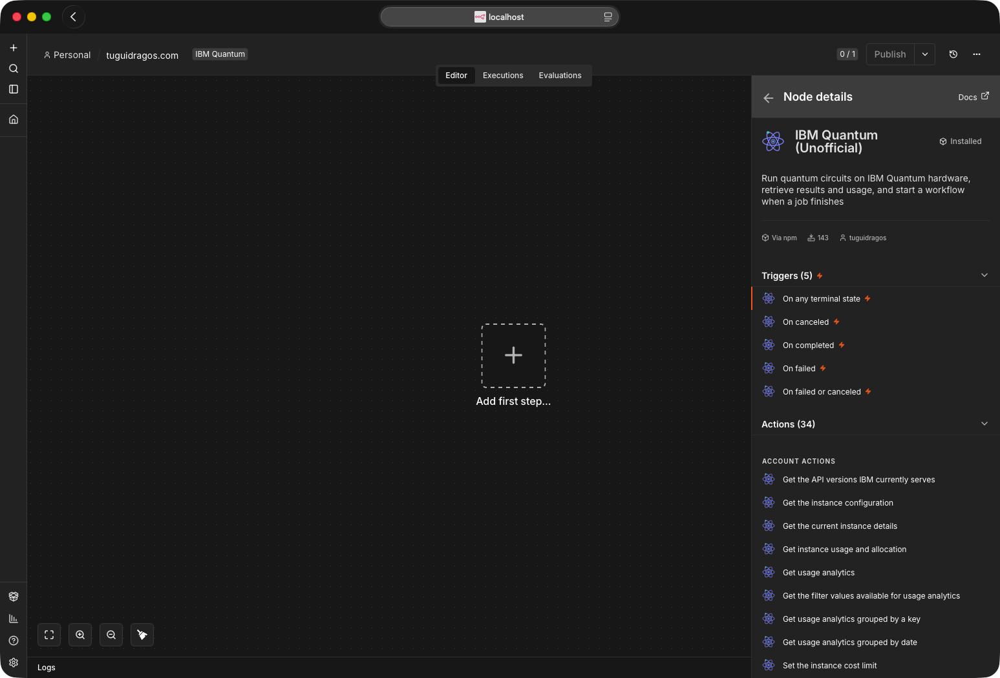
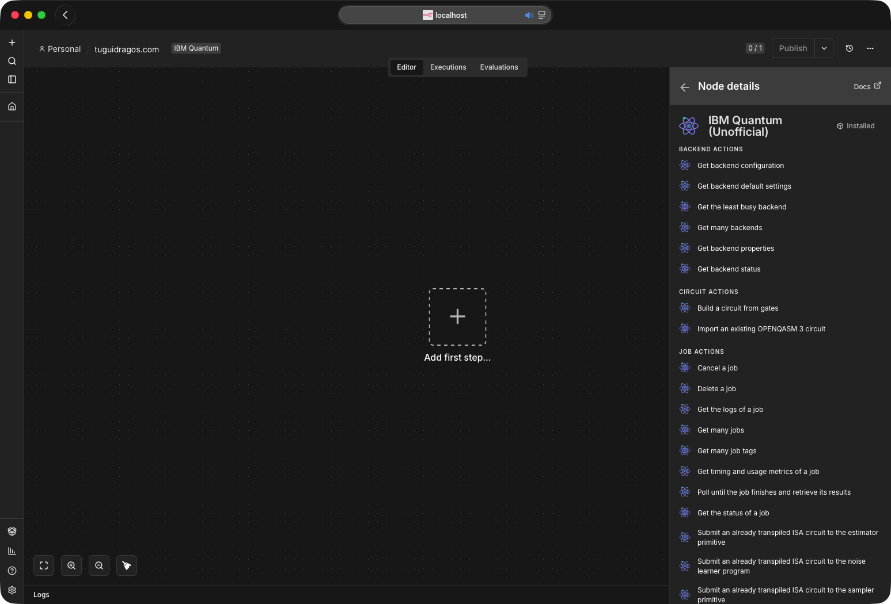
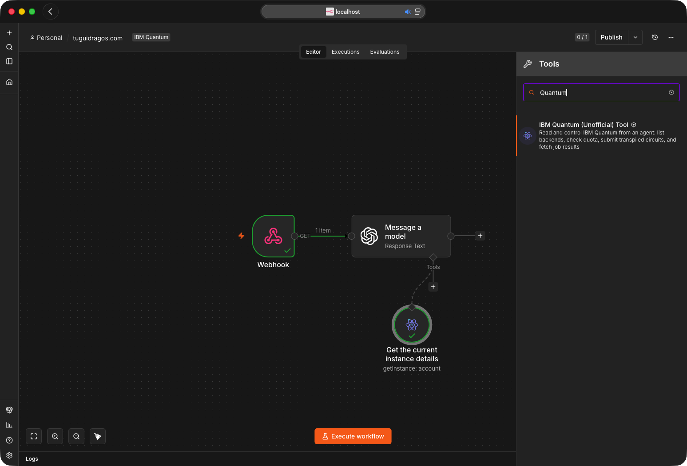
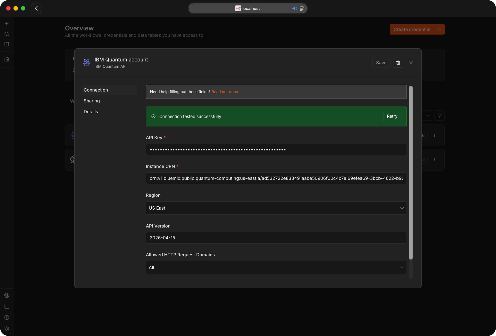
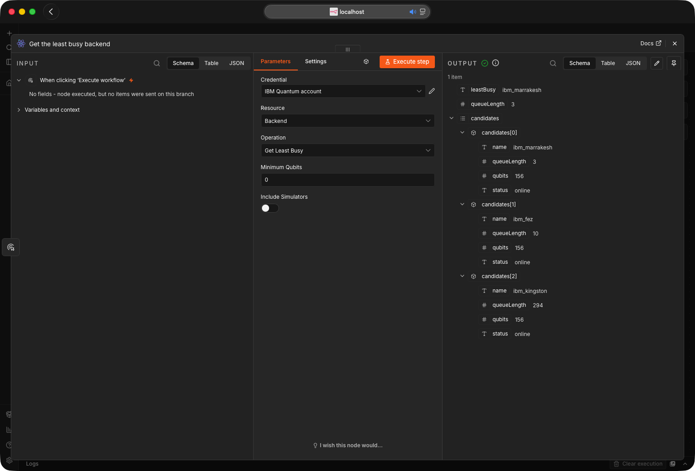
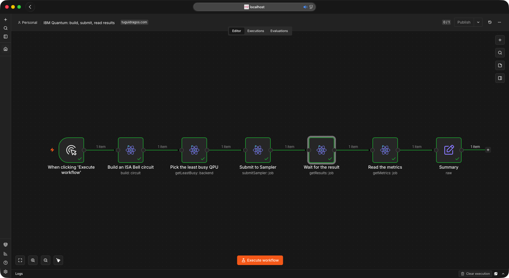
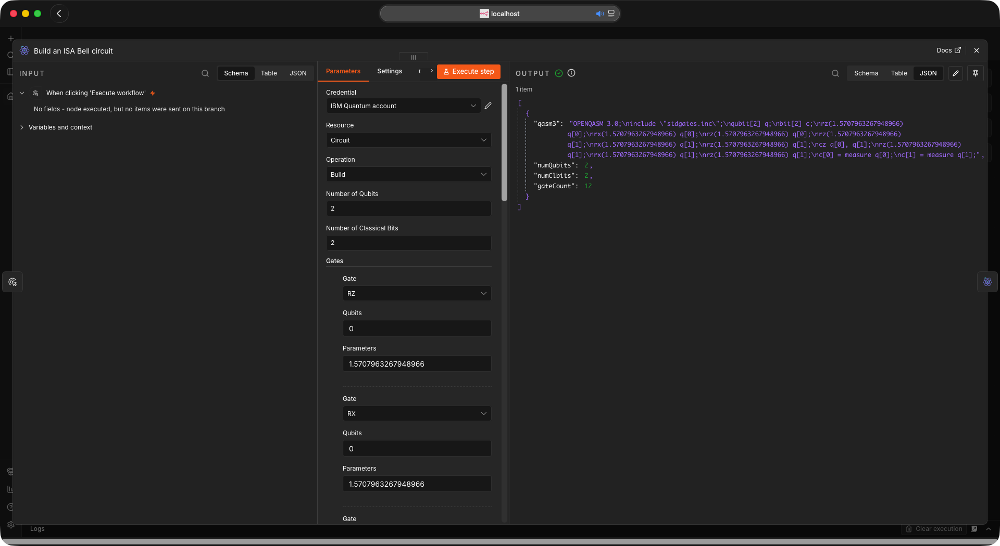
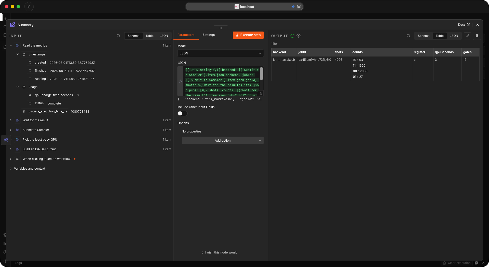
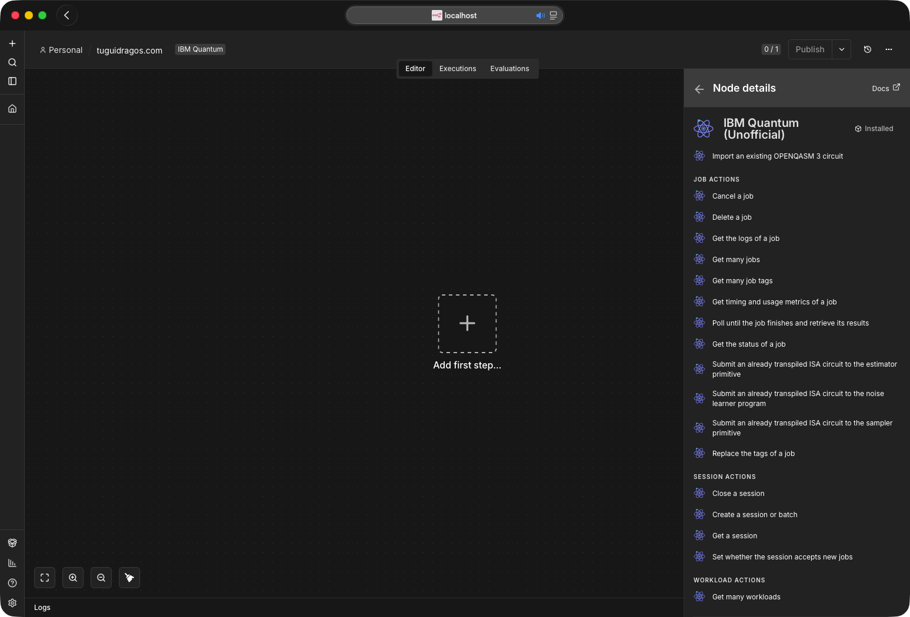

<!--
  README for n8n-nodes-ibm-quantum
  Banners and screenshots live in readme-assets/ so they never collide with dist/ or the node sources.
  Every banner is a plain SVG with CSS keyframes: no build step, no dependencies.
-->


<p align="center">
  <a href="https://github.com/TuguiDragos/n8n-nodes-ibm-quantum/actions/workflows/ci.yml"></a>
  <a href="https://www.npmjs.com/package/n8n-nodes-ibm-quantum"></a>
  <a href="https://www.npmjs.com/package/n8n-nodes-ibm-quantum"></a>
  <a href="https://docs.n8n.io/integrations/community-nodes/installation/"></a>
  <a href="https://nodejs.org/en/about/previous-releases"></a>
  <a href="https://youtu.be/6ppR6uCt1_o"></a>
  <a href="https://github.com/TuguiDragos/n8n-nodes-ibm-quantum?tab=MIT-1-ov-file"></a>
</p>

<p align="center"><sub>Unofficial, community-maintained node. Not affiliated with, endorsed by, or sponsored by IBM. IBM Quantum and Qiskit are trademarks of International Business Machines Corporation.</sub></p>

Build, run and retrieve quantum circuits on the IBM Quantum Platform, straight from n8n.

Verified by n8n, so it installs on n8n Cloud as well as self-hosted. Zero runtime dependencies: no Qiskit, no quantum library, nothing to compile. Circuits travel as OpenQASM 3 strings and the IBM Cloud API key is exchanged for a short-lived IAM bearer token that n8n caches and refreshes on its own.

<br>

---

## What it does

Three entries in the n8n picker, all carrying an **(Unofficial)** marker to keep them clearly
distinct from anything IBM publishes. A fourth node, the retired Error Trigger, still ships but is
hidden from the panel so that workflows built on it keep running.

| node | type | what it is for |
| :-- | :-- | :-- |
| **IBM Quantum (Unofficial)** | action | Every operation below |
| **IBM Quantum (Unofficial) Trigger** | polling trigger | Fires when a job reaches a terminal state, with the failure reason when there is one |
| **IBM Quantum (Unofficial) Tool** | AI Agent tool | The same operations, callable by a model. Generated by n8n from the action node, so it needs no separate setup |

36 operations across 6 resources. Three are new in 0.6.0, Get Account Configuration, Get Many Instances and Set Cost Limit, and the last two talk to IBM Cloud's Resource Controller rather than to the Qiskit Runtime hosts.

| resource | operations |
| :-- | :-- |
| **Backend** | Get Many, Get Configuration, Get Defaults, Get Properties, Get Status, Get Least Busy (by queue length or IBM's estimated wait) |
| **Circuit** | Build (from a gate list, with symbolic parameters), Import OpenQASM 3 |
| **Job** | Submit to Sampler, Submit to Estimator, Submit to Noise Learner, Get Status, Get Results, Get Logs, Get Metrics, Get Many (with filters, or every job with Return All), Get Many Tags, Update Tags, Cancel, Delete |
| **Workload** | Get Many (jobs, sessions and batches together, with cursor paging or Return All) |
| **Session** | Create (batch or dedicated), Get, Set Accepting Jobs, Close |
| **Account** | Get Usage, Get Instance, Get Configuration, Get Account Configuration, Get Many Instances, Set Cost Limit, Get Usage Analytics, Get Usage Analytics Grouped, Get Usage Analytics Grouped by Date, Get Usage Analytics Filters, Get API Versions |

Five of the six **Backend** fields are dropdowns filled from your own account, labeled with the
processor family and revision, the device status and its queue depth, for example
`ibm_kingston (Heron r2, online, 290 queued)`. The list is fetched when you open the node and again
on **Refresh List** in the field menu; it is not polled, so those numbers are a snapshot rather than
a live reading. Switch the field to **Expression** to type or compute a name instead, which is what
you want when the backend comes from an earlier node such as Get Least Busy. Only the bare name is
stored, so nothing breaks if a label changes.

**Get Properties** and **Get Configuration** take an optional **Calibration ID**, and Get Properties
also an **Updated Before** time. Every job reports the calibration it ran with as `calibration_id`,
in the Submit response and in Job › Get Status, so feeding that value back here returns the
properties and configuration IBM associates with that calibration rather than today's, which is what
reproducing an experiment needs. Updated Before asks instead for the properties last updated before
a given time. Left empty, both operations return the current calibration, exactly as before.

<p align="center">
  
</p>
<p align="center"><sub>One entry in the trigger picker. The retired Error Trigger is hidden, so there is nothing to choose between.</sub></p>

<p align="center">
  
  
</p>
<p align="center"><sub><b>Triggers (5)</b> and <b>Actions (33)</b> in one entry, as the panel read on 0.5.0: the five job states on the left, then Account, Backend, Circuit and Job as you scroll, with Session and Workload below. 0.6.0 adds Get Account Configuration, Get Many Instances and Set Cost Limit to the Account list, for 36.</sub></p>

<br>

---

## Use it as an AI Agent tool

The action node sets `usableAsTool`, so it can be attached to an n8n **AI Agent** as a tool and the model calls its operations directly. It is a good fit for the read paths, where the agent asks a question and gets a structured answer:

- *"Which QPU has the shortest queue right now?"* &rarr; Backend, Get Least Busy
- *"Which Heron device will start my job soonest?"* &rarr; Backend, Get Least Busy with **Rank By** on an estimated wait and **Processor Family** `Heron`
- *"How much runtime is left on my instance?"* &rarr; Account, Get Usage
- *"Which backends and session limits does my plan allow?"* &rarr; Account, Get Account Configuration
- *"Did job d1abc finish?"* &rarr; Job, Get Status, with **Include Circuit Params** off so the answer is the state rather than the circuit

Submission works too, but the agent has to supply a circuit the backend accepts. On real hardware that means a transpiled ISA circuit, so pair it with a pre-built circuit rather than asking the model to write one. See [Transpilation](#transpilation).

The two trigger nodes carry no `usableAsTool`: a polling trigger has nothing for an agent to call, and the verification ruleset now forbids the property on triggers. Until 0.3.3 the same ruleset required it on every node, so n8n listed a tool variant of each trigger that could never actually run; if you still see those variants, ignore them and attach the action node.

What the model actually reads is the operation's own action text, not the node's description: with
n8n's default **Set Automatically**, the tool description is built per operation, which is why the
three submit actions spell out that the circuit must already be transpiled. Between February 2025 (PR #13075) and n8n 1.85.0 (PR #14042, merged 19 March 2025), self-hosted n8n needed `N8N_COMMUNITY_PACKAGES_ALLOW_TOOL_USAGE` set to true before any community node could be used as an agent tool; 1.85.0 removed the variable and turned tool usage on for every community node, so on n8n 1.85.0 or newer nothing extra is needed for the tool.

The variables self-hosted n8n reads today concern community packages as a whole, not tool usage: `N8N_COMMUNITY_PACKAGES_ENABLED` (on by default; off disables verified and unverified packages alike), `N8N_VERIFIED_PACKAGES_ENABLED` and `N8N_UNVERIFIED_PACKAGES_ENABLED` (both on by default), `N8N_COMMUNITY_PACKAGES_PREVENT_LOADING` (off by default; for an instance that a faulty node stops from starting), `N8N_COMMUNITY_PACKAGES_REGISTRY`, `N8N_COMMUNITY_PACKAGES_AUTH_TOKEN` and, since n8n 2.21.0, `N8N_COMMUNITY_PACKAGES_MANAGED_BY_ENV` with `N8N_COMMUNITY_PACKAGES`. n8n 3.0 flips the default of `N8N_UNVERIFIED_PACKAGES_ENABLED` to false. That does not touch this package, because it is verified; the one caveat is that n8n verifies each release separately, so a version newer than the latest one n8n lists as verified counts as unverified until that listing catches up. The full list is on n8n's [environment variables for nodes](https://docs.n8n.io/deploy/host-n8n/configure-n8n/basic-configuration/use-environment-variables/nodes) page.

<p align="center">
  
</p>
<p align="center"><sub>The tool attached to a model node. Search finds it as <b>IBM Quantum (Unofficial) Tool</b>; the green ticks are a real run where the model called Get Instance Details and answered from the result.</sub></p>

<br>

---

## Docs for AI assistants

The repository follows the [llms.txt](https://llmstxt.org) convention. [`llms.txt`](./llms.txt) is the index; [`llms-full.txt`](./llms-full.txt) is a complete machine-oriented reference: every operation, every parameter under its internal name, output shapes, error codes, a runnable workflow JSON and the hardware pitfalls. Hand either file to an LLM before asking it to build workflows with this node, and it will stop guessing parameter names.

Both files ship inside the npm tarball as well as sitting in the repository, so an assistant can reach them three ways: from a checkout, from the installed package, or by URL.

```
https://raw.githubusercontent.com/TuguiDragos/n8n-nodes-ibm-quantum/main/llms.txt
https://raw.githubusercontent.com/TuguiDragos/n8n-nodes-ibm-quantum/main/llms-full.txt
```

Neither URL is reachable from inside n8n. The **Docs** link on the node opens this README, because each node class sets `documentationUrl` and the editor returns that before it ever consults the codex file; the codex entry for `llms-full.txt` is therefore never read, and `llms.txt` is not in the codex at all. The MCP server passes on no documentation URL either: what it gives a model is the parameter definitions and each operation's action text. So paste one of the raw URLs above into an assistant yourself, rather than assuming it will find them.

[AGENTS.md](AGENTS.md) is the companion for agents changing the code rather than using it.

<br>

---

## Install

On self-hosted n8n, open the community nodes screen and enter the package name `n8n-nodes-ibm-quantum`. It is verified by n8n, so it is also installable directly on n8n Cloud.

**You need**

- An IBM Cloud account with access to the IBM Quantum Platform
- An IBM Cloud API key
- The Cloud Resource Name (CRN) of your Qiskit Runtime instance
- n8n on a version that supports community nodes, running on Node.js 24. n8n has required Node 24 since 2.36 (August 2026); Node.js 22 (22.22 or newer) is enough only for n8n 2.35 and older, and the package itself runs on either

<br>

### Credentials

Create an **IBM Quantum API** credential with four fields.

| field | where it comes from |
| :-- | :-- |
| **API Key** | [IBM Cloud, Manage &rsaquo; Access (IAM) &rsaquo; API keys](https://cloud.ibm.com/iam/apikeys). Copy it immediately, it is shown once. The node exchanges it for a short-lived IAM token at request time. |
| **Instance CRN** | The [IBM Quantum Platform instances page](https://quantum.cloud.ibm.com/instances). Starts with `crn:v1`, sent as the `Service-CRN` header. It also carries your account id as its `a/<account id>` field, which **Account &rsaquo; Get Account Configuration** reads from it, so nothing else needs typing in. |
| **Region** | US East or EU (Germany), matching your instance. This picks the API host, and the two are separate. The region belongs to the instance, not to the credential: measured against the EU host with a US East CRN, authentication succeeds and only the instance is missing. |
| **API Version** | The date in the `IBM-API-Version` header, which selects the response schema. Defaults to `2026-04-15`, the only version IBM does not list as deprecated; change it only when [IBM's REST API reference](https://quantum.cloud.ibm.com/docs/en/api/qiskit-runtime-rest) calls for a newer one. The node checks the field before every run: a value that is not a real date fails immediately with a message naming the field, and an older-but-still-live date logs a warning rather than blocking a credential that works today. Every version before `2026-04-15` has a published sunset during 2027. |

The credential ships a test that calls the backends endpoint, so the **Test** button confirms all four fields at once. If you would rather watch it done, the [setup walkthrough](https://youtu.be/6ppR6uCt1_o) covers this screen.

<p align="center">
  
</p>
<p align="center"><sub>All four fields filled, and the green bar after pressing <b>Test</b>. <b>Read our docs</b> opens the table above.</sub></p>

<br>

---

## A first workflow

4 nodes that prepare a Bell state, pick a backend, run it and read the counts.

1. **Circuit &rsaquo; Build.** Number of Qubits `2`, Number of Classical Bits `2`. Gates in order: Hadamard on `0`; CNOT/CX on `0,1`; Measure on `0` with Classical Bit `0`; Measure on `1` with Classical Bit `1`. Outputs `qasm3`, `numQubits`, `numClbits`, `gateCount`, `instructionCount`. Rename this node to `Build`, because step 3 refers to it by name; n8n names it after the operation, `Build a circuit from gates`, otherwise.
2. **Backend &rsaquo; Get Least Busy.** Minimum Qubits `2`; leave **Rank By** on `Queue Length` and **Processor Family** empty. Outputs `leastBusy`.
3. **Job &rsaquo; Submit to Sampler.** Backend `={{ $json.leastBusy }}`, OpenQASM 3 Circuit `={{ $('Build').item.json.qasm3 }}`, Shots `1024`. Outputs `jobId`.
4. **Job &rsaquo; Get Results.** Job ID `={{ $json.jobId }}`, Poll Interval `5`, Max Wait `300`. Outputs the parsed `pubs`, each carrying `counts`.

This flow uses the textbook `h` and `cx` gates so it stays readable, and a real QPU does not run
those natively: submitted as-is to hardware, the job fails with `reason_code: 1517` and still
spends quota. Before a hardware run, read [Transpilation](#transpilation), or build the same Bell
state from native gates only as shown in
[Building an ISA circuit directly in the node](#building-an-isa-circuit-directly-in-the-node),
which runs as written.

<p align="center">
  
</p>
<p align="center"><sub>Step 2 on real devices: <code>ibm_marrakesh</code> wins with 3 queued, against 10 on <code>ibm_fez</code> and 294 on <code>ibm_kingston</code>. Every candidate comes back too, as the output read on 0.5.0; 0.6.0 adds the processor family, the revision and IBM's estimated wait in seconds to each one, and a <b>Rank By</b> option that sorts on those figures.</sub></p>

<br>

---

## An end-to-end run

The same four steps, wired up and run against real hardware, with two extra nodes that read the
metrics and flatten the answer. Every gate is native, so nothing had to be transpiled first.

<p align="center">
  
</p>
<p align="center"><sub>Build, pick a QPU, submit, wait, read the metrics, summarize. Each node hands one item to the next; the backend and the circuit are expressions, not typed in.</sub></p>

The circuit is built by the node itself. A Bell state needs a Hadamard, which no IBM device runs
natively, so it is written as `rz(pi/2) sx rz(pi/2)` and the CNOT becomes `cz` between two of
those. Twelve gates, all inside the device's basis set.

<p align="center">
  
</p>
<p align="center"><sub>Gates go in one row at a time; <code>qasm3</code>, <code>numQubits</code>, <code>numClbits</code>, <code>gateCount</code> and <code>instructionCount</code> come out. This is the circuit the Sampler receives.</sub></p>

Submitting returns a `jobId` straight away. **Get Results** then polls until the job reaches a
terminal state and parses the samples into counts, and **Get Metrics** reports what IBM actually
charged, which is the QPU time alone and not the minutes the job spends being loaded and compiled.

A job submitted from Qiskit rather than from here comes back in a different encoding, because IBM
picks it from the submitted parameters: `qiskit-ibm-runtime` sets `support_qiskit`, and the result
body is then a serialized Qiskit object graph whose measurement arrays are compressed. Get Results
reads it, marks those entries `encoding: "qiskit-serialized"`, and hands the arrays through as
`samplesEncoded` or `fieldsEncoded` rather than as `counts`, since inflating them needs a library
community nodes may not import. Decode them with Qiskit, or read `raw`.

<p align="center">
  
</p>
<p align="center"><sub>The payoff. 2066 <code>00</code> and 1950 <code>11</code> out of 4096 shots, the two correlated outcomes a Bell state should give, and 53 plus 27 shots of real device error. IBM charged <b>3 QPU seconds</b> for it.</sub></p>

<br>

---

## Long-running jobs

Real hardware jobs can sit in the queue for minutes or hours. How you wait for the result matters.

**Get Results blocks the execution while it polls.** It calls the job endpoint every Poll Interval seconds until the job finishes or Max Wait is reached, holding that one execution open the whole time. Each poll asks for the status alone (`exclude_params=true`, the same as the trigger), so waiting on a job with a hundred circuits costs a few hundred bytes per check rather than the whole payload. Fine for quick jobs on a short queue; fragile for a long hardware queue, because if n8n restarts or the run hits a limit the execution is interrupted and you see "Execution stopped at this node". IBM exposes no push or callback (verified against the API), so something has to poll. The question is whether it blocks a running execution.

**Get Status** is the one-off check. It returns the job as IBM stores it, circuit included, which is what it has always returned; its **Include Circuit Params** toggle, on by default, turns that off for a lighter read, for example inside a loop or from an AI Agent asking whether a job finished.

**The healthy pattern splits submission from result handling.**

- One workflow submits and finishes immediately with the `jobId`. Nothing blocks.
- A second, **active** workflow starts with the **IBM Quantum Trigger**. It polls in the background on the n8n scheduler, not inside a held-open execution, and fires only when a job reaches a terminal state. Its Get Results returns at once, because the job is already done.

Set the cadence with the built-in Poll Times field and choose which terminal status fires it. The trigger only runs while its workflow is **active**; for a one-off check use Fetch Test Event. Each poll requests `pending=false` and `exclude_params=true`, so it scans only finished jobs and skips circuit payloads, which keeps it light and stops a burst of new submissions from pushing a finished job out of the scan window. If several workflows share one instance, set **Tags** on Submit and the matching **Tags** filter on the trigger, so each workflow reacts only to its own jobs. The filter takes several comma-separated tags, and a job must carry all of them to match.

For production alerting, set **Trigger On** to **Failed or Canceled**, which ignores successful runs and fires only on a queue timeout, a calibration fault, or a manual cancel from the IBM dashboard. Every event carries `reason`, `reasonCode` and `reasonSolution` from the job's state, alongside the untouched job, so a workflow can page an engineer or resubmit to another backend instead of stalling. The fields are `null` when the job did not fail, and IBM leaves them empty for cancellations.

Earlier releases shipped a separate **IBM Quantum Error Trigger** for this. It is hidden from the node panel from this release on, but it remains installed and any workflow already using it keeps running unchanged.

The option above covers the same jobs, and carries the same three reason fields, but it is not a drop-in swap: the two nodes shape their output differently, so moving a workflow across means rewriting the expressions that read it.

| | Error Trigger | Trigger, Failed or Canceled |
| :-- | :-- | :-- |
| the job ID | `jobId` | `id` |
| the status | `status`, always lowercase, for example `cancelled` | `status` as IBM wrote it, for example `Cancelled`, and absent entirely if IBM omits it |
| the raw job | nested under `job` | spread across the top level |
| the reason fields | `reason`, `reasonCode`, `reasonSolution` | the same three, identical |

The payloads are deliberately left as they are: changing either would break the workflows already running on it.

<br>

---

## Sessions and batches

Hybrid loops (VQE, QAOA) submit many circuits in sequence, adjusting parameters between iterations. Submitting each as a standalone job sends every iteration back to the general queue. The **Session** resource avoids that.

- **Create** a session in mode **Batch** (jobs run consecutively; the default, and the only mode the Open plan allows) or **Dedicated** (reserves the backend for low-latency back-to-back jobs, paid plans only; on an Open instance IBM refuses it with `code 1352`, whose registry text reads "You are not authorized to run a session when using the {} plan", the braces standing for the plan name). It returns a `sessionId`. **Max TTL** is the longest the session may live, and IBM caps it per plan: 10 minutes on Open, 8 hours on the paid plans. The field's default of 28800 seconds is the paid-plan ceiling, so on Open a batch ends after 10 minutes whatever the field says; when the maximum TTL is reached IBM ends the workload and any job still queued fails. A **Dedicated** session that is opened and receives no job for 30 minutes closes on its own. Both modes also carry an interactive TTL that cannot be configured: when it passes with nothing queued the workload is deactivated rather than ended, and any later job reactivates it until the maximum TTL. IBM documents that window as 1 minute for a **Batch** on every plan and 60 seconds for a **Dedicated** session on the Premium plan, and says an instance may be configured with a different value; **Session &rsaquo; Get** reports the one in force as `interactive_ttl`, in seconds.
- Pass that `sessionId` into the **Session ID** field of each Submit, so the jobs run inside the reservation.
- **Close** the session at the end so it stops holding the backend. Close is immediate: queued jobs will not run and a running job finishes. Setting **Accepting Jobs** to false is equally final but lets the jobs already queued run first: IBM ends the session once they are done rather than pausing it, and turning the flag back on does not reopen it.

Use **Account &rsaquo; Get Usage** to check `usage_consumed_seconds` against `usage_limit_seconds` before launching a large run.

Batch is the only mode the Open plan allows. The current plan lineup is Open, Pay-As-You-Go, Flex, Premium and On-Prem, and the Open allowance is 600 seconds per rolling 28 days rather than per calendar month.

<p align="center">
  
</p>
<p align="center"><sub>The four Session operations, with Workload underneath, at the end of the action list.</sub></p>

<br>

---

## Building circuits

The Circuit Build operation takes a gate list and emits an OpenQASM 3 string. Each gate has a **Qubits** field and, for parametric gates, a **Parameters** field; both are comma separated. A delay has a **Duration** field instead, and the operation itself has a **Circuit Parameters** field for symbolic angles.

- Single-qubit gates take one index, for example `0`.
- Controlled gates take the control first and the target last, so `0,1` is control 0 and target 1.
- Toffoli takes two controls and a target, `0,1,2`.
- Angles are radians, or the name of a parameter listed in **Circuit Parameters**. The U gate takes exactly three (theta, phi, lambda).
- Measure writes to the classical bit given in the **Classical Bit** field.
- Delay takes a **Duration**: a number followed by `ns`, `us`, `ms`, `s` or `dt`, for example `100ns` or `160dt`. A `dt` count must be a whole number.
- **Circuit Parameters** takes comma-separated names, for example `theta,phi`. Each is declared as `input float[64] theta;` and may replace any angle in a gate's Parameters field; bind them at submit time through the Sampler or Estimator **Parameters** field, as an object: `{"theta": 1.5708, "phi": 0.5}`. Use the object form whenever more than one name is declared. A bare array is not matched in declaration order: Qiskit's OpenQASM 3 importer returns a program's parameters sorted by name, and a positional array is bound against that order, so `[1.5708, 0.5]` on `theta,phi` gives `phi` the first value and the job runs with the two angles swapped. The output carries `parameterNames` in declaration order, which is the order of the `input` lines.

### Supported gates

| gate | qubits | params | what it is | on IBM hardware |
| :-- | :-- | :-- | :-- | :-- |
| `id` | 1 | 0 | Identity | accepted, emitted as nothing, see below |
| `x` | 1 | 0 | Pauli X | runs as-is |
| `sx` | 1 | 0 | Square root of X | runs as-is |
| `y` `z` | 1 | 0 | Pauli Y, Z | transpile first |
| `h` | 1 | 0 | Hadamard | transpile first |
| `s` `sdg` | 1 | 0 | Phase &pi;/2 and its inverse | transpile first |
| `t` `tdg` | 1 | 0 | Phase &pi;/4 and its inverse | transpile first |
| `rx` `rz` | 1 | 1 | Rotation about X, Z | runs as-is |
| `ry` | 1 | 1 | Rotation about Y | transpile first |
| `p` | 1 | 1 | Phase | transpile first |
| `u` | 1 | 3 | Generic single-qubit unitary (theta, phi, lambda) | transpile first |
| `cz` | 2 | 0 | Controlled-Z | runs as-is |
| `rzz` | 2 | 1 | ZZ interaction; the program carries Qiskit's `gate rzz` definition block | runs as-is on Heron, fractional |
| `cx` | 2 | 0 | CNOT, control first | transpile first |
| `swap` | 2 | 0 | Swap | transpile first |
| `crx` `cry` `crz` | 2 | 1 | Controlled rotation, control first | transpile first |
| `ccx` | 3 | 0 | Toffoli, two controls then the target | transpile first |
| `measure` | 1 | 0 | Writes to the classical bit you name | runs as-is |
| `reset` | 1 | 0 | Reset to \|0&rang; | runs as-is |
| `delay` | 1 | 0, plus a Duration | Idle for `100ns`, `2.5us`, `1ms`, `1s` or `160dt` | runs as-is |
| `barrier` | any | 0 | Optimization barrier; omit qubits for the whole register | directive, always fine |

**Runs as-is** means the instruction is in the backend's own `basis_gates` and reaches the target unchanged, so a circuit made only of those needs no transpiler. On a Heron processor that set is `x`, `sx`, `rx`, `rz`, `rzz`, `cz`, plus measure, reset, delay and barrier, which is enough to build real circuits, and IBM extends it: on 2026-09-10 all three devices this project reaches also list `xslow`, which was not there two days earlier and which `stdgates.inc` does not define, so a bare call to it fails the way a bare `rzz` does and draws the same warning: see [Building an ISA circuit directly in the node](#building-an-isa-circuit-directly-in-the-node). Everything marked **transpile first** is defined by the OpenQASM 3 standard library in terms of the builtin `U`, or is a two-qubit gate the chip does not implement, and IBM rejects it with `the instruction ... is not supported`. Check any given backend with Backend &rsaquo; Get Configuration, which returns its `basis_gates` directly. The three Submit operations read that same field once per OpenQASM 3 submit and warn, naming the chosen backend's basis, about any instruction outside it and outside the configuration's `supported_instructions`; if the configuration cannot be read the warning falls back to the Heron union (`cz, id, rx, rz, rzz, sx, x`).

The U gate is emitted as the OpenQASM 3 builtin `U`, uppercase. A lowercase `u` is not defined in `stdgates.inc` and IBM's parser rejects it.

Identity is the one gate that is accepted and then dropped. `stdgates.inc` defines `id` as `U(0, 0, 0)`, and a circuit containing an identity failed every job it appeared in with "the instruction u on qubits (n,) is not supported", measured for 0.3.3 on `ibm_kingston` and `ibm_marrakesh`, even though IBM lists `id` among the native instructions of every backend and its OpenQASM 3 feature table marks the builtin `U` as supported. The likely cause is IBM's importer expanding the `stdgates.inc` definition before the target sees it, not the hardware refusing `U`; re-measured on 2026-09-07, it still happens, with the same message. Since identity is the no-op, omitting it leaves a mathematically identical circuit that runs. Its operands are still validated, so a bad index is still an error rather than a silent drop. The output reports both `gateCount`, the rows in the gate list, and `instructionCount`, the instruction lines actually written, so a dropped identity shows up as the difference. An `id` inside OpenQASM you supply yourself is not dropped, because the node never rewrites your program; Submit warns about it instead, in the same `warnings` list as the other checks, and still sends the job.

Bad input is caught at build time, not at IBM: the wrong number of qubits or parameters, an index outside the register, a multi-qubit gate given the same qubit index twice, a non-numeric value, a measure aimed past the classical register, or a zero, negative or non-integer register size. The error names the gate and what it expected.

<br>

---

## Primitives and options

Submit is split per program, because their inputs differ.

- **Submit to Sampler** returns measurement counts. Set **Shots**.
- **Submit to Estimator** returns expectation values. Set **Observables** to a Pauli string whose length matches the qubit count (`ZZ` for two qubits) or an array of them, pick a **Resilience Level**, and optionally a **Precision**. **Default Precision** fills in for PUBs that set none, **Seed Estimator** makes the sampling repeatable, and **Resilience Options** opens the individual switches behind the level: measurement mitigation, ZNE with its noise factors, extrapolators and amplifier, PEC with its overhead cap and noise gain, and the layer noise learning that PEC and PEA rely on. PEC, PEA and gate twirling are refused on a circuit with fractional gates.
- **Submit to Noise Learner** returns the noise itself rather than a result: it characterizes the Pauli-Lindblad error channels on the entangling layers your circuit uses, which is what error mitigation consumes underneath. It takes the same circuit and its own options, and **Get Results** hands back one `noiseLearner` entry per learned layer, carrying the qubits it covers and its Pauli generators, in whichever of the two spellings IBM answers with; llms-full.txt lists both field by field. Set **Number of Classical Bits** to `0` on the circuit you feed it: the learner never measures your circuit, and IBM rejects one that carries a classical register as soon as it splits into more than one entangling layer. The node warns when a line of the circuit starts with `bit[n]`, glued as Circuit Build writes it, and at least two of its statements name two or more distinct qubits in the glued spelling the scanner reads. **Max Layers to Learn**, **Number of Randomizations** and **Shots per Randomization** can each be left at zero to let IBM choose. **Layer Pair Depths** is left empty instead, because `0` there is a real depth that gets sent, and **Twirling Strategy** always sends whichever value is selected. Note that randomizations multiply shots, so this is the easiest way to spend a lot of quota quickly; pair it with **Max Cost**.

Both share the error-suppression toggles that matter on hardware: **Dynamical Decoupling**, **Gate Twirling**, **Measurement Twirling**. Leave Gate Twirling off for a circuit containing fractional gates, meaning a parametrized `rx` or `rzz`, which includes anything Qiskit transpiles for a Heron processor: IBM refuses that combination with "gate twirling does not support fractional gates". The same refusal, code 1519, meets a fractional gate wherever IBM turns twirling on itself: an Estimator at Resilience Level 2 or with PEC, and every Noise Learner job, which learns by twirling, both measured on `ibm_marrakesh` on 2026-09-10. Submit warns before the job goes out, naming the gates and what turned twirling on; transpile without fractional gates for those runs (`use_fractional_gates=False` on the backend in qiskit-ibm-runtime). The other two have no such restriction. The toggles have collections beside them for the finer settings: **Dynamical Decoupling Options** (sequence type, slack distribution, scheduling method, skipping reset qubits) refines the first and applies wherever dynamical decoupling is on, whether from the toggle or from an `enable` written into Additional Options, and **Twirling Options** (number of randomizations and shots per randomization, each a whole number or `auto`, and the strategy) refines the other two and matters wherever twirling is on, including where IBM turns it on itself, as Estimator Resilience Level 2 does. **Execution Options** (initialising qubits, the repetition delay and, for the Sampler, the measurement type) needs no toggle. A collection entry is sent only when you add it. For parametrized circuits, **Parameters** takes a JSON object binding names to values, e.g. `{"theta": 1.5708}`. **Additional Options** is a JSON escape hatch merged into the primitive `options`, e.g. `{"execution": {"rep_delay": 0.00025}}`. Only the top-level keys IBM's schema lists for the chosen program are accepted (six for Sampler, nine for Estimator, eight for the noise learner), and an unknown one is refused locally, naming the key and the keys that would have been accepted, before anything is sent. There is no `environment` key in the REST API: that is the Python client's bundle for `log_level`, `job_tags` and `private`, which are the **Log Level**, **Tags** and **Private** fields here. The dedicated fields win over anything repeated there, key by key: **Shots** travels with the circuit and overrides `default_shots`, the three toggles above overwrite their own keys, and every collection entry overwrites the same key in the JSON while leaving its siblings alone. The keys and the values each collection offers are IBM's OpenAPI spec (0.50.5), and an Estimator job carrying all four collections at once completed on `ibm_fez` on 2026-09-07.

Both also accept **Tags** (comma separated, stored on the job and usable as a filter in Job › Get Many and in both triggers) and a **Private** toggle that hides the job's inputs and results from collaborators, on plans that support private jobs. IBM's specification attaches a deletion rule to that toggle: the inputs go once the job completes, and the results go once they have been read, so a private job's shots reach exactly one Get Results and a second one finds nothing.

All three submits also take an optional **Calibration ID**, sent as the job-level `calibration_id`, naming the calibration the job should run with. IBM accepts 1 to 100 characters and the node refuses a longer value before submitting. Whether or not you set it, the job reports the calibration it actually used in the same field, which is the value to hand to Backend › Get Properties when you want the device data behind a result.

**Max Cost** caps how many runtime seconds a job may consume before IBM cancels it. IBM allows at most 10800 (3 hours) and the node clamps anything larger. Zero, the default, omits the field, and IBM then stamps the job with the plan maximum, which on the Open plan is the entire 600 second allowance for the 28 day window, so leaving it at zero is the worst case rather than a neutral one. Verified live: a job submitted with Max Cost at zero came back carrying `cost: 600`. Set a real number to stop one runaway job from spending everything. For a ceiling across every job on the instance rather than one, use **Account &rsaquo; Set Cost Limit**, which writes it through IBM Cloud's Resource Controller.

**Circuit Format** picks how the circuit is written. OpenQASM 3 is the default and the text form the Circuit resource builds. Choosing QPY instead swaps that field for **QPY Circuit**, which preserves circuits OpenQASM 3 cannot express. The encoding is the one IBM's own client uses, and it is easy to get wrong: the QPY bytes must be **zlib compressed and only then base64 encoded**, because the service decompresses them on arrival. In Python that is `qiskit.qpy.dump(circuit, buffer)` followed by `base64.b64encode(zlib.compress(buffer.getvalue()))`. Base64 of the raw bytes is refused locally, with a message naming the missing step, because IBM otherwise accepts the job and fails it with reason code 1603 after trying to read the text as QASM. Either way the circuit still has to be ISA for the chosen backend, and either way the node validates it locally before spending a submission.

### Finding jobs again

**Job › Get Many** returns recent jobs newest first, up to **Limit** (IBM's maximum is 200 per call). Turn on **Return All** to get every job the filters match instead: the node walks the listing 200 at a time, starting at the Offset filter when one is set, merges the pages into one `jobs` array, and stops after 50 pages (10,000 jobs) with `truncated: true` in the output when more remain. Either way it takes a **Filters** collection:

| filter | what it narrows to |
| :-- | :-- |
| **Backend** | Jobs that ran on one device |
| **Program** | Sampler, Estimator or Noise Learner jobs |
| **Tags** | Jobs carrying every tag you list, comma separated, up to the 8 the API accepts |
| **Session ID** | Jobs that ran inside one session or batch |
| **Status** | All, only finished, or only queued and running |
| **Created After** / **Created Before** | A time window |
| **Sort** / **Offset** | Order, and how many jobs to skip; with Return All on, the offset is where the walk starts |
| **Include Circuit Params** | Brings each job's submitted circuit back into the response, which is omitted by default to keep listings small |

Tags are the practical way to find your own work on a shared instance: set them on Submit, filter on them here and in both triggers. **Job &rsaquo; Get Many Tags** shows which tags actually exist, narrowed by a search term of 3 to 100 characters, which saves guessing at a name you set weeks ago. IBM offers no way to list every tag, so the term is required; a shorter one is refused locally rather than by a bare 400 from the API.

**Log Level** on any Submit raises the verbosity IBM records for that job, and Get Logs reads it back afterwards. Leave it on Default unless you are chasing a failure.

**Workload &rsaquo; Get Many** answers the question Job › Get Many cannot: it returns jobs, sessions and batches in one listing, with a free-text **Search** over IDs and tags and a **Mode** filter to keep only one kind. It pages by cursor rather than by offset: IBM returns the next and previous pages as links, so each response also carries `nextCursor` and `previousCursor`, the token lifted out of each link, which you feed back into **Next Cursor** or **Previous Cursor**; they are `null` on the last and first page. IBM caps it at 50 per call rather than the 200 Job › Get Many allows, so **Return All** is here too: it follows the next link 50 workloads per request, merges the pages into one `workloads` array, and stops after 20 pages (1,000 workloads), adding `truncated: true` and leaving `nextCursor` on the page it stopped at so you can carry on from there.

### Watching the quota

**Account &rsaquo; Get Usage** is the quick check. For reporting, the analytics operations return the same spend broken down: **Get Usage Analytics** for totals, **Get Usage Analytics Grouped**, whose **Group By** field takes backend, instance, plan, user or subscription, and **Get Usage Analytics Grouped by Date** for a time series. All three take the same Filters collection (backends, instances, plans, users, subscriptions, a date window, and a Simulators toggle that IBM still accepts although it retired its cloud simulators in May 2024), and **Get Usage Analytics Filters** lists the values your account may filter on. None of them consume QPU time, so a Schedule Trigger plus Get Usage Analytics Grouped is a cheap monthly spend report. Every usage and queue-time figure they return is in milliseconds, which IBM's specification states on each field, whereas Get Usage and Get Metrics report seconds, so divide by 1000 before comparing the two.

The instance-wide spend ceiling lives in IBM Cloud's Resource Controller, which is where IBM's own spec now sends anyone who used the deprecated configuration endpoint. **Account &rsaquo; Set Cost Limit** writes it there: **Cost Limit (Seconds)** caps the QPU seconds the instance may spend, **Clear Limit** removes the cap instead, and the response carries `instanceLimitSeconds` read back from IBM. A value the node cannot read as a whole number of at least one second fails before the request rather than clearing the cap by accident. The operation targets the credential's instance unless **Instance CRN** names another one. **Account &rsaquo; Get Many Instances** lists every IBM Quantum instance the API key can see, optionally filtered by **Plan**, each with its cost limit, allocation and allowed backends under `extensions`; with **Return All** off you get IBM's own page unchanged, with it on the node follows the pages and returns them merged. The write went through the old endpoint until 0.5.0, when it was removed because IBM's endpoint hung; the Resource Controller path has not been exercised from this project against a live account, so treat the first write as a test and read the value back with Get Many Instances.

**Account &rsaquo; Get Account Configuration** is the account-wide view the reads above lack: one entry per plan the account holds, each with its usage limit and allocation in seconds, what is still unallocated to instances, the backends the plan may use, the session caps (`max_ttl`, `active_ttl`, `interactive_ttl`), the contract window and the Qiskit Functions it grants. IBM's endpoint wants an account id that no other call returns, so the node reads it from the credential: your instance CRN carries it as the `a/<account id>` field. A CRN without that field fails locally with a message naming the credential rather than reaching IBM. **Plan ID** narrows the answer to one plan, by the Global Catalog id that Get Instance reports as `plan_id`; leave it empty for all of them.

### Reading results

**Bit order.** Sampler counts follow the classical register: `c[0]` is the rightmost bit of each bitstring, the standard Qiskit convention. Samples arrive as hex and are decoded with BigInt, so registers wider than 53 bits keep every bit instead of silently collapsing distinct outcomes. A sample the parser cannot read is dropped rather than folded into a neighboring outcome, and the pub then carries `unparsedSamples` so the gap between `counts` and `shots` is visible instead of silent.

Get Results detects the classical register on its own. **Register Name** overrides that, for the rare circuit that declares more than one and you want the counts from a specific register. A name no pub in the result carries does not fail the item: the result body has been downloaded by the time the name is judged, and IBM hands a private job's results over once only, so failing would destroy the run. The item comes back with `registerError` naming the registers that are there, whenever the result carries any: a plain result body with no classical register at all, an estimator result from a job submitted here for one, ignores the name entirely, while the serialized Qiskit encoding compares against the PUB field names, so an estimator result submitted from elsewhere reports against `evs` and `stds`. Every pub that read a register other than the one asked for carries `registerFallback: true` and `requestedRegister`, so another register's counts never come back under the name you asked for. Branch on `registerError` where a mistyped name must stop the workflow, remembering that only a result with names to list carries it.

<br>

---

## Transpilation

The single most common reason a real-hardware job fails, so it is worth understanding.

### Why it is needed

A textbook circuit uses high-level gates like `h` and `cx`. A real chip does not run those. Each backend executes a small set of **native gates** (a Heron processor such as `ibm_fez` runs `rz`, `sx`, `x`, `cz`, plus measure and reset) over a fixed qubit topology. Translating a circuit into that gate set and connectivity is **transpilation**, and the result is an **ISA** (Instruction Set Architecture) circuit.

The Qiskit Runtime REST API **does not transpile**. It expects an ISA circuit and rejects anything else. Submit a raw circuit to real hardware and the job fails with `reason_code: 1517`:

```
The instruction h on qubits (0,) is not supported by the target system.
Transpile your circuits for the target before submitting a primitive query.
```

That is not a node bug. The node builds, submits and reads the job correctly; the hardware refuses a non-ISA circuit.

### Building an ISA circuit directly in the node

Transpiling is the general answer, but for small circuits you can skip it entirely: build straight from the native gate set with the Circuit Build operation. The palette covers a Heron processor's whole basis, which is more than the Bell state below needs and takes no external tooling at all.

2 identities do most of the work:

```
H            = rz(pi/2) . sx . rz(pi/2)            (up to a global phase)
CNOT(c -> t) = H(t) . cz(c, t) . H(t)
```

A Bell state built that way, with 12 gate entries and no Qiskit anywhere, runs as-is. Copy this table row by row into the Gates field:

| gate | qubits | parameters |
| :-- | :-- | :-- |
| RZ | `0` | `1.5707963267948966` |
| SX | `0` | |
| RZ | `0` | `1.5707963267948966` |
| RZ | `1` | `1.5707963267948966` |
| SX | `1` | |
| RZ | `1` | `1.5707963267948966` |
| CZ | `0,1` | |
| RZ | `1` | `1.5707963267948966` |
| SX | `1` | |
| RZ | `1` | `1.5707963267948966` |
| Measure | `0` | Classical Bit `0` |
| Measure | `1` | Classical Bit `1` |

Set **Number of Qubits** and **Number of Classical Bits** to `2`. The circuit the node emits is, gate for gate, what Qiskit writes for a transpiled Bell state, and every gate in it is marked **runs as-is** in the palette.

One difference from Qiskit's output is worth knowing. The palette declares a virtual register (`qubit[2] q;`) and addresses `q[0]`; Qiskit's exporter writes physical qubits (`$0`) and declares nothing. IBM's [OpenQASM 3 feature table](https://quantum.cloud.ibm.com/docs/en/guides/qasm-feature-table) says that for execution on hardware only circuits written in terms of hardware qubits such as `$0` are valid, and that custom `gate` definitions are not valid for hardware verbatim. In practice the virtual form runs today: every measurement in this README used it, and IBM places `q[i]` on physical qubit `i` unchanged, which is what the coupling failure below shows when it names qubits `(0, 5)` for `cz q[0], q[5]`. The `$n` form is the one IBM promises. If a palette circuit that is in basis and on coupled qubits ever fails with `1517`, rewriting it with `$n` and no register declaration is the first thing to try; the submit warnings read both forms.

Using the right gates is only half of it: a two-qubit gate also has to land on a pair the chip physically connects. `cz q[0], q[1]` runs on `ibm_fez`, `cz q[0], q[5]` does not, and IBM accepts that job, queues it, and only then fails it with `code 1517, the instruction cz on qubits (0, 5) is not supported by the target system`. The node reads the backend's coupling map at submit time and says so first, naming the pair and what the qubit does connect to. It names at most twenty pairs: a circuit that was never transpiled can land on thousands of them, and past the twentieth one closing sentence counts the rest and tells you to transpile. It reads both spellings, the virtual `q[0]` the palette writes and the physical `$0` Qiskit writes for a transpiled circuit, and a second quantum register is numbered after the ones declared before it, the way IBM's importer lays them out: `qubit[2] a;`, `qubit [2] a;` and the legacy `qreg a[2];` all count toward that offset, while a size that is not a plain number, `qubit[N] a;`, counts as nothing. It is a warning, not a block. The call that fetches the map also supplies the backend's `basis_gates` and `supported_instructions`, so it is made once for every OpenQASM 3 submit and the ISA warning names the basis of the backend you picked rather than a fixed list; a Nighthawk device is judged by `cz, id, rz, sx, x`, a Heron device by its own list.

Measured on `ibm_fez` over 2048 shots: 48.7% `00` and 46.2% `11`, with 5.0% leaking into `01` and `10` from readout error. That is the correlation an entangled pair should show.

This recipe is deliberately built on `sx` rather than a parametrized `rx`. Both give a valid Hadamard on Heron, but `rx(pi/2)` is a *fractional* gate, and fractional gates are incompatible with Gate Twirling and with the ZNE and PEC mitigation behind Estimator resilience level 2. IBM's newer **Nighthawk** r1 processors (`ibm_miami` in us-east, `ibm_berlin` in eu-de, on Premium and Flex) run `cz`, `id`, `rz`, `sx`, `x` with no fractional `rx` at all, and the Nighthawk r2 `ibm_phoenix` (September 2026, paid plans) has no published basis yet, so read it from Backend &rsaquo; Get Configuration before assuming. The `sx` form above therefore runs unchanged on both fleets and stays compatible with every mitigation option. When a circuit does need fractional gates, set **Processor Family** to `Heron` on Get Least Busy so it never lands on a Nighthawk device.

Gates that are safe to use this way: **X, SX, RX, RZ, RZZ, CZ, Delay, Reset, Barrier, Measure**. `sx` was added to the palette after being verified on `ibm_fez`: `stdgates.inc` defines it, so the node emits the bare `sx q[n];` that Qiskit itself writes for a transpiled circuit, and IBM runs it. Two of them in a row read 249 of 256 shots as 1, which is `X`, and a single one reads a 47/53 split, which is the superposition. `rzz` joined the palette in 0.6.0, and the reason it was missing was the definition rather than the gate. `stdgates.inc` does not define `rzz`, so a bare `rzz(0.5) q[0], q[1];` comes back Failed naming `gate 'rzz' is not defined`, measured on `ibm_fez`. Do not match on the reason code: that identical program was rejected as 1506 at 04:37 UTC and as 1603 at 17:29 UTC the same day on the same device, so IBM varies it and only the message is dependable. The same call carrying a `gate rzz` definition block ahead of it completed on `ibm_fez` and returned 64 of 64 shots on `00`, the correct reading for a diagonal phase gate on the ground state; that run is recorded with the operand names `a, b`, as `gate rzz(p0) a, b { cx a, b; rz(p0) b; cx a, b; }`. The palette now writes the same definition once, right after the include line, whenever a circuit uses `rzz`, in the spelling Qiskit 2.5.2 exports: `gate rzz(p0) _gate_q_0, _gate_q_1 { cx _gate_q_0, _gate_q_1; rz(p0) _gate_q_1; cx _gate_q_0, _gate_q_1; }`. The operand names are local to the block, so the two are the same definition. `rzz` is a fractional gate like `rx`: Heron accepts it for angles in (0, pi/2], Nighthawk does not offer it, and it is incompatible with Gate Twirling and with resilience level 2. For OpenQASM you supply yourself, the node still warns about the bare form and stays quiet about the defined one. Everything else in the palette (`h`, `cx`, `u`, `swap`, `ccx`, the daggered gates) is defined by the OpenQASM 3 standard library in terms of the builtin `U`, which hardware rejects, so those need a transpiler pass first. Identity is a special case: it is accepted but emits nothing, because `stdgates.inc` defines it as `U(0, 0, 0)` and a job carrying it failed every time it was measured, even though IBM lists `id` as native; an `id` in OpenQASM you supply yourself gets a warning at submit time for the same reason.

### How to transpile, free, on any plan

Transpile locally with Qiskit, then feed the ISA string into the node. You do not need live credentials: a fake backend carries the real topology and native gate set. Current Qiskit (2.5+) needs Python with NumPy 2.0 or newer.

```python
from qiskit import QuantumCircuit, qasm3
from qiskit.transpiler.preset_passmanagers import generate_preset_pass_manager
from qiskit_ibm_runtime.fake_provider import FakeFez  # mirrors ibm_fez

backend = FakeFez()

qc = QuantumCircuit(2, 2)
qc.h(0)
qc.cx(0, 1)
qc.measure(0, 0)
qc.measure(1, 1)

isa = generate_preset_pass_manager(optimization_level=1, backend=backend).run(qc)
print(qasm3.dumps(isa))  # paste this into the node
```

Transpile against the backend object, as above, and not against a bare `basis_gates` list with the coupling map: the list carries no angle range, so Qiskit folds `rzz` angles freely and writes calls such as `rzz(-pi/2)`, which IBM's fractional `rzz` refuses after queueing with code 1517, "supported only for angles in the range [0, pi/2]", measured on `ibm_marrakesh` on 2026-09-10 with a Grover circuit and a QFT. Submit warns about such a call before the job goes out. For a real run, swap the fake backend for the live one (`QiskitRuntimeService(channel="ibm_cloud", token=..., instance=...).backend("ibm_fez")`) so the layout matches the exact device.

A Bell circuit transpiled for `ibm_fez` comes out in native gates only:

```
OPENQASM 3.0;
include "stdgates.inc";
bit[2] c;
rz(pi/2) $0;
sx $0;
rz(pi/2) $0;
rz(pi/2) $1;
sx $1;
rz(pi/2) $1;
cz $0, $1;
rz(pi/2) $1;
sx $1;
rz(pi/2) $1;
c[0] = measure $0;
c[1] = measure $1;
```

### Running it in the node

1. Put the ISA string into **Circuit &rsaquo; Import OpenQASM 3**, or paste it into the **OpenQASM 3 Circuit** field of a Submit operation. That field also takes a list: an expression resolving to an array of circuits submits all of them as one job, which matters because a job costs about two QPU seconds before it runs a single gate.
2. Pin **Backend** to the exact device you transpiled for, not Get Least Busy. An ISA circuit is specific to one topology and another device may reject it. The node checks the pairs in a transpiled circuit against the backend's coupling map as well, so the pairs the other device does not connect are warned about before the job is queued, the first twenty by name and the rest as a count.
3. Submit to Sampler or Estimator as usual.

### AI transpiler passes

IBM used to offer transpilation as a remote REST API. That is gone: the guide for it now answers 410, and the host it lived at no longer resolves. The successor, [AI-powered transpiler passes](https://quantum.cloud.ibm.com/docs/en/guides/ai-transpiler-passes), ships in the `qiskit-ibm-transpiler` package and, in IBM's words, runs "on your local environment". It is in beta. Since there is no longer a service to call, transpiling is a local step on every plan, which is what the recipe above already does.

### Simulators

There are none. IBM retired its cloud simulators on 15 May 2024, so every device the backends list returns is real hardware, and the API marks the `is_simulator` field as deprecated and due for removal. **Include Simulators** on Get Least Busy stays so saved workflows keep loading, but it has nothing left to include: every job runs on a QPU and needs the ISA circuit described above. To try a circuit without spending quota, simulate it locally with Qiskit before submitting; the node itself has no simulator.

<br>

---

## Troubleshooting

| symptom | cause and fix |
| :-- | :-- |
| **401 or IAM token errors on every call** | The API key is wrong, revoked or expired. Regenerate it in IBM Cloud and update the credential. |
| **404 or an empty backends list** | The Region does not match the region of your instance CRN. US East and EU (Germany) are separate hosts. IBM answers `code 1279` and names your CRN: *"Instance crn:... not found"*. The key itself is fine, which is why the error mentions the instance rather than authentication. Verified by calling the EU host with a US East CRN. |
| **Get Results returns `timedOut: true` and no counts** | The job was still queued or running when Max Wait ran out. This is not an error: the job keeps running on IBM, so read it back later with Get Results, raise Max Wait, or submit and use the trigger instead of blocking. |
| **Job fails with `reason_code: 1517`** | The circuit was not transpiled to the backend's native gates. See [Transpilation](#transpilation). |
| **Submit rejected by IBM** | Observables length does not match the qubit count, or the circuit is not valid ISA for the chosen backend. |
| **"is not a YYYY-MM-DD date"** | The credential's API Version field holds something that is not a real date. Set it back to `2026-04-15`. Account &rsaquo; Get API Versions lists what IBM currently serves. |
| **Submissions failing in bursts** | IBM rate-limits job submission to five per minute per user. Space them out, or run them inside a session. |
| **Job fails with another `reason_code`** | IBM's [error registry](https://quantum.cloud.ibm.com/docs/en/errors) defines every code. The ones this node's own scenarios produce: `1506` "QASM parsing failed" and `1603` "Error loading QASM circuit with the standard Qiskit loaders" (the same bad program draws either, so match on the message); `1519` fractional gates combined with Gate Twirling, PEC or PEA; `1520` "Circuits or PUBs exceed one or more system limits", split the job; `1521` "Incompatible circuits and/or options specified"; `1522` a dynamic circuit sent to the Estimator, which only the Sampler runs; `5302` "maximum payload exceeded", fewer shots or fewer circuits per job; `1352` a Dedicated session on the Open plan; `1501` observables that do not match the qubit count of the transpiled circuit, lay them out with `apply_layout`; `1217` "Session has been closed", a job that was still queued in a session when Close ran, since Close cancels queued work rather than draining it. |
| **Get Many Instances or Set Cost Limit answers 403** | The key is valid for the Qiskit Runtime instance but has no IBM Cloud platform role on it: the Resource Controller checks platform roles where the Qiskit Runtime API checks service access. Grant one on the instance in IBM Cloud IAM; which role the write requires has not been verified, and IBM's cost guide says only administrators and owners can edit an instance. The Qiskit Runtime operations are unaffected either way. Not yet measured from this project. |

Errors coming back from IBM are unwrapped before they reach you. IBM returns `{ errors: [{ code, message, solution }] }`, which n8n's default error handling never reads, so it would show a generic "Bad request". The node pulls the real message out, and IBM's suggested solution becomes the error description.

<br>

---

## Development

```bash
npm install      # --ignore-scripts skips the isolated-vm native build
npm run lint     # ESLint, the n8n rulesets plus recommended rules for tests and scripts
npx --no -- n8n-node lint  # the same config through the official n8n CLI, as verification runs it
npm run format:check   # Prettier, gated in CI because ESLint does not enforce it
npm run build    # compile TypeScript, then copy icons and codex files into dist
npm test         # Vitest, the full unit suite
npm run test:coverage  # the same suite against the coverage gate
npm run scan     # the official n8n community package scanner
```

Lint, the n8n CLI's own lint, formatting, build and coverage run in CI on Node 24, which n8n has required since 2.36, and on Node 22, which n8n 2.35 and older still run on and which `engines.node` (`>=22`) still admits. Coverage is a gate rather than a report: the thresholds are 100 for statements, branches, functions and lines, so an untested line fails the build. `isolated-vm`, a native transitive dev dependency pulled in by `n8n-workflow`, is not needed to lint, build or test, which is why install scripts are skipped. The build step runs `scripts/copy-assets.mjs` after `tsc`, because TypeScript compiles neither the icons nor the codex `.node.json` files.

The scan runs on its own schedule too. The n8n verification ruleset changes independently of this repository, and has already broken a release that was compliant when it shipped, so `scan.yml` runs the official scanner monthly and on demand rather than waiting for the next publish to discover it. The scanner prints its verdict and exits 0 either way, so `npm run scan` pipes it through `scripts/scan-verdict.mjs`, which passes its output through and fails on anything that is not a pass; the scheduled job runs that same command, so a failed scan turns the run red instead of leaving it green.

See [CONTRIBUTING.md](CONTRIBUTING.md) and the [Code of Conduct](CODE_OF_CONDUCT.md) for the full workflow, [AGENTS.md](AGENTS.md) if you are pointing an AI coding agent at this repository, [SECURITY.md](SECURITY.md) for reporting a vulnerability, and [CHANGELOG.md](CHANGELOG.md) for release history.

<br>

---

## Notes on the live API

IBM renamed the service **IBM Quantum Compute Service** in July 2026. The endpoints, headers and payloads are unchanged, so the rename affects only what the documentation calls it.

Request and response shapes follow the published Qiskit Runtime REST API reference. The job body sends the primitive as `program_id`, the circuit inside a PUB, and `version` 2 in `params`, with `resilience_level` at the params level for the Estimator. Sampler results are read from `results[i].data[register].samples` as hex strings. The least busy backend is chosen from the backends list, requested with `fields=wait_time_seconds` so that one call carries each device's status, qubit count, queue length, processor family and IBM's estimated wait (average, median and 95th percentile, in seconds). Array query parameters are sent as repeated keys (`tags=a&tags=b`), the form the API recognizes; the default bracket encoding is ignored by IBM, which would make a tag filter quietly return everything. Every request the node itself issues carries a 30 second timeout so a hung connection cannot stall an execution. The credential Test button and the IAM token exchange run through n8n's own helpers and take n8n's defaults instead. Get Many Instances and Set Cost Limit are the only operations that leave the Qiskit Runtime hosts: they call IBM Cloud's Resource Controller at `resource-controller.cloud.ibm.com` with the same token, and [SECURITY.md](SECURITY.md) lists all four hosts.

IBM's own limits are worth knowing before a busy workflow meets them: job submission is rate limited to five per minute per user, a single job may use at most 3 hours of QPU time, a Sampler job is capped at ten million executions, and per circuit IBM allows 30 million `rz`, 20 million `sx` and five million two-qubit gates within 26.8 million control-system instructions per qubit. IBM publishes no payload size in bytes: an oversized job is refused with `code 5302`, "maximum payload exceeded", and the documented remedy is fewer shots per job (IBM suggests under 10000) with the results stitched together afterwards. Job data is retained for 3 years.

The action node is on **typeVersion 2**. The only difference from version 1 is the internal name of the session mode parameter, renamed from `mode` to `sessionMode`. Observed live on 0.4.1: n8n's MCP server left a parameter named `mode` out of the type definition it gives AI workflow builders, so on version 1 an agent could not choose between a batch and a dedicated session. The likely cause is that `@n8n/workflow-sdk` treats `resource`, `operation` and `mode` as discriminator fields; whether that applies to every community node was not traced, so treat the rename as a measured fix rather than a documented n8n rule. Existing version 1 workflows keep working untouched, and both parameters are exercised by the test suite.

<br>

---

## Watch it run

A full walkthrough: creating the credential, wiring the nodes and running a circuit end to end.

**[Setting up and running the IBM Quantum node](https://youtu.be/6ppR6uCt1_o)**

<br>

---

## Articles

- [My IBM Quantum node for n8n is now live](https://tuguidragos.com/ibm-quantum-node-for-n8n/). The launch, the n8n verification, and what the 3 nodes do.
- [Running Quantum Circuits on Real IBM Hardware from n8n](https://tuguidragos.com/quantum-circuits-ibm-hardware-n8n/). An end-to-end Bell state on a real QPU (ibm_kingston), including the transpilation step that trips up most first attempts.
- [Six defects in a verified n8n node for IBM Quantum](https://tuguidragos.com/six-defects-verified-n8n-node-ibm-quantum/). What 121 seconds of real QPU time found that green tests and 98 percent coverage could not, including the identity gate that fails every job despite being listed as native, and why a failed circuit still costs you quota.
- [One circuit, two IBM Quantum error codes: 1506 and 1603](https://tuguidragos.com/ibm-quantum-error-code-1506-1603/). The same rejected program submitted twenty times in a row came back eleven times as one code and nine times as the other, and the job metrics say why: one code arrives from validation in half a second, the other from execution two seconds later, and only one of them names the gate that caused it.

<br>

---

## License

<p><a href="LICENSE">MIT</a> &nbsp;&#183;&nbsp; <a href="mailto:contact@tuguidragos.com">contact@tuguidragos.com</a></p>

<br>

---

<p align="center">Built with 🖤 by <a href="https://tuguidragos.com">Țugui Dragoș</a></p>
