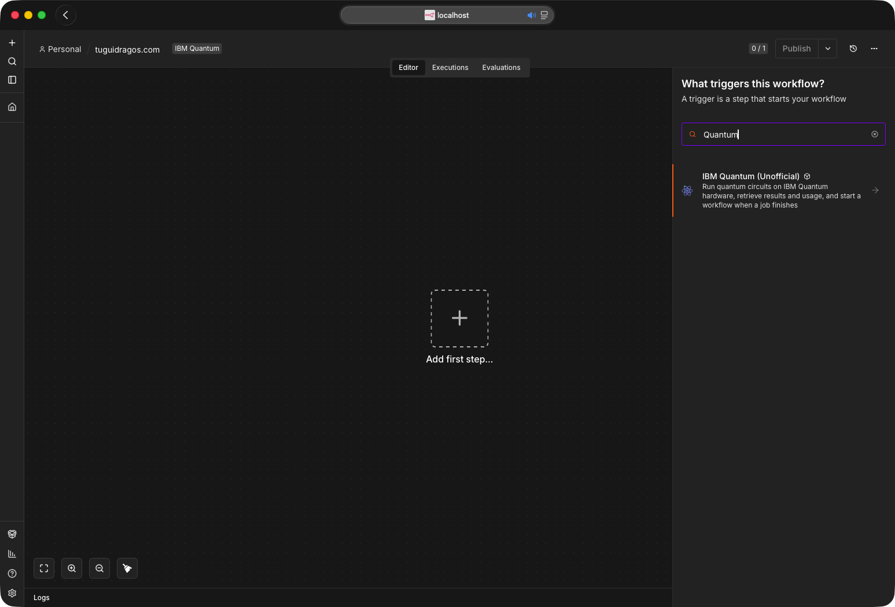
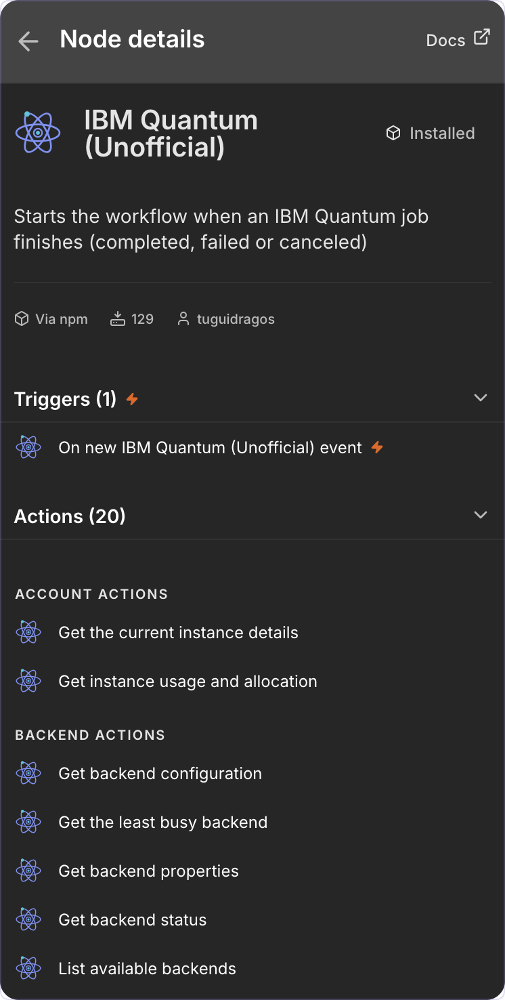
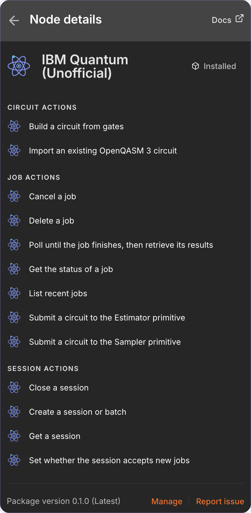
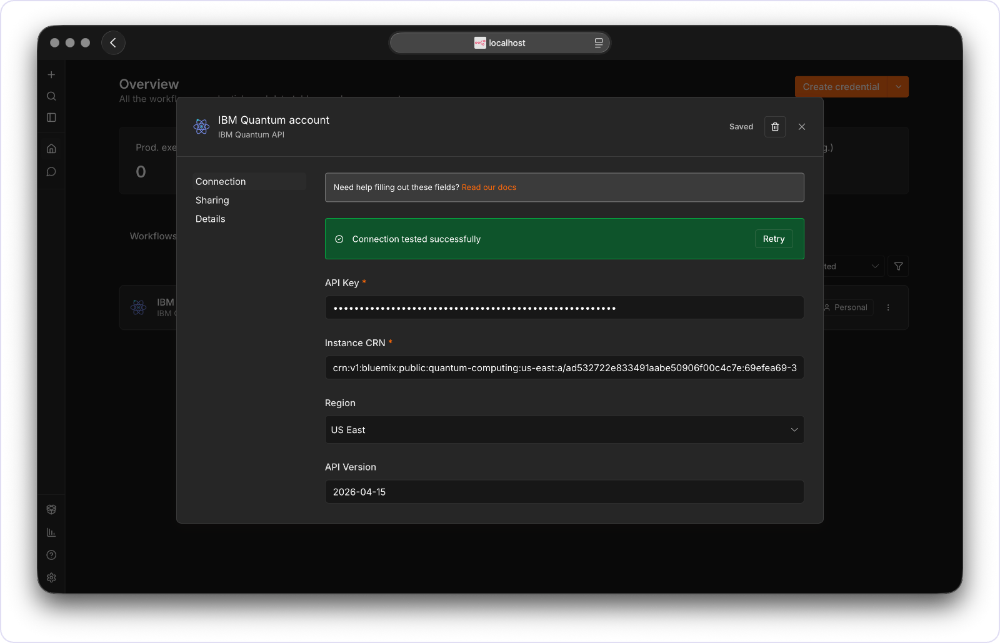
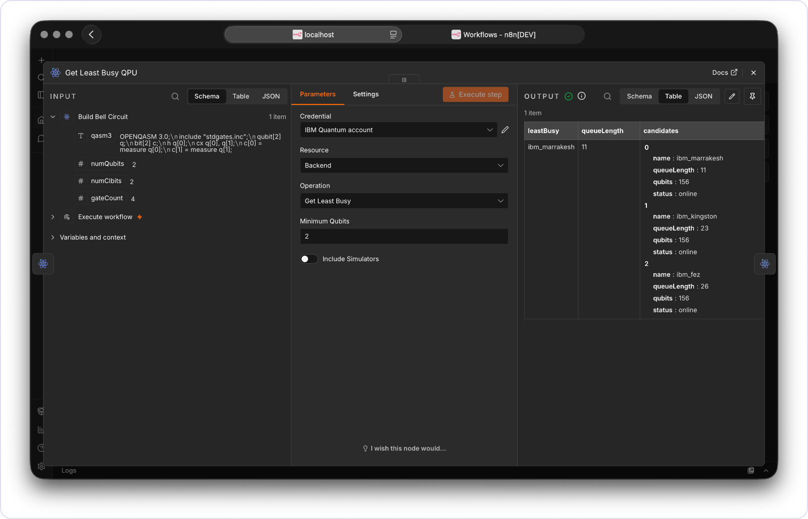
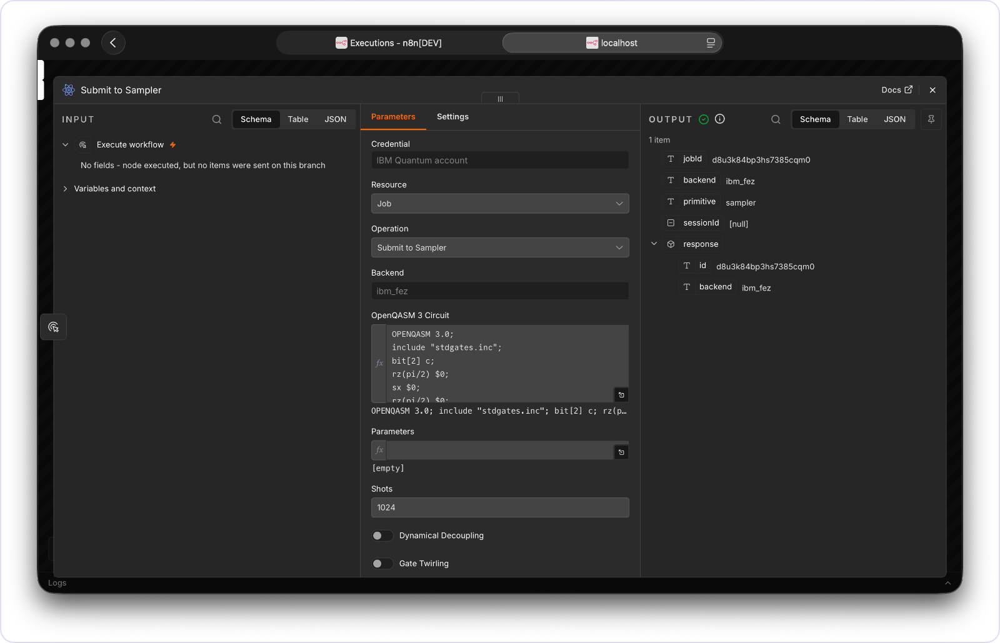
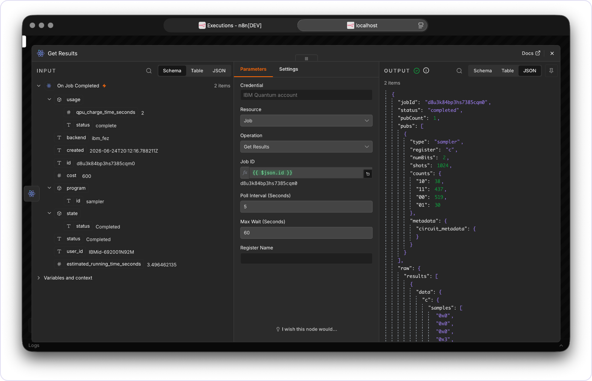

<!--
  README for n8n-nodes-ibm-quantum
  Banners and screenshots live in readme-assets/ so they never collide with dist/ or the node sources.
  Every banner is a plain SVG with CSS keyframes: no build step, no dependencies.
-->



<p align="center">
  <a href="https://github.com/TuguiDragos/n8n-nodes-ibm-quantum/actions/workflows/ci.yml"></a>
  <a href="https://www.npmjs.com/package/n8n-nodes-ibm-quantum"></a>
  <a href="https://www.npmjs.com/package/n8n-nodes-ibm-quantum"></a>
  <a href="https://docs.n8n.io/integrations/community-nodes/installation/"></a>
  <a href="https://nodejs.org/en/about/previous-releases"></a>
  <a href="https://youtu.be/6ppR6uCt1_o"></a>
  <a href="https://github.com/TuguiDragos/n8n-nodes-ibm-quantum?tab=MIT-1-ov-file"></a>
</p>

<p align="center"><sub>Unofficial, community-maintained node. Not affiliated with, endorsed by, or sponsored by IBM. IBM Quantum and Qiskit are trademarks of International Business Machines Corporation.</sub></p>

---

Build, run and retrieve quantum circuits on the IBM Quantum Platform, straight from n8n.

Verified by n8n, so it installs on n8n Cloud as well as self-hosted. Zero runtime dependencies: no Qiskit, no quantum library, nothing to compile. Circuits travel as OpenQASM 3 strings and the IBM Cloud API key is exchanged for a short-lived IAM bearer token that n8n caches and refreshes on its own.

<br>

### What it does

Three nodes ship in the package. In the n8n picker they carry an **(Unofficial)** marker, to keep them clearly distinct from anything IBM publishes.

| node | type | what it is for |
| :-- | :-- | :-- |
| **IBM Quantum (Unofficial)** | action | Every operation below |
| **IBM Quantum (Unofficial) Trigger** | polling trigger | Fires when a job reaches a terminal state |
| **IBM Quantum Error (Unofficial) Trigger** | polling trigger | Fires only on failure or cancellation, with the reason |

Twenty four operations across five resources.

| resource | operations |
| :-- | :-- |
| **Backend** | List, Get Configuration, Get Properties, Get Status, Get Least Busy |
| **Circuit** | Build (from a gate list), Import OpenQASM 3 |
| **Job** | Submit to Sampler, Submit to Estimator, Get Status, Get Results, Get Logs, Get Metrics, List (with filters), Update Tags, Cancel, Delete |
| **Session** | Create (batch or dedicated), Get, Set Accepting Jobs, Close |
| **Account** | Get Usage, Get Instance, Get Configuration |

<p align="center">
  
</p>
<p align="center"><sub>Both trigger nodes appear in the n8n trigger picker.</sub></p>

<p align="center">
  
  
</p>
<p align="center"><sub>All five resources and their operations in the node's action list.</sub></p>

<br>

### Use it as an AI Agent tool

The action node sets `usableAsTool`, so it can be attached to an n8n **AI Agent** as a tool and the model calls its operations directly. It is a good fit for the read paths, where the agent asks a question and gets a structured answer:

- *"Which QPU has the shortest queue right now?"* &rarr; Backend, Get Least Busy
- *"How much runtime is left on my instance?"* &rarr; Account, Get Usage
- *"Did job d1abc finish?"* &rarr; Job, Get Status

Submission works too, but the agent has to supply a circuit the backend accepts. On real hardware that means a transpiled ISA circuit, so pair it with a pre-built circuit rather than asking the model to write one. See [Transpilation](#transpilation).

The two trigger nodes also set `usableAsTool`, because the n8n verification ruleset requires the property and the type allows only `true`. n8n then lists a tool variant of each trigger. Ignore those: a polling trigger has nothing for an agent to call. Attach the action node instead.

<br>

---

## Watch it run

A full walkthrough: creating the credential, wiring the nodes and running a circuit end to end.

**[Setting up and running the IBM Quantum node](https://youtu.be/6ppR6uCt1_o)**

## Articles

- [My IBM Quantum node for n8n is now live](https://tuguidragos.com/ibm-quantum-node-for-n8n/). The launch, the n8n verification, and what the three nodes do.
- [Running Quantum Circuits on Real IBM Hardware from n8n](https://tuguidragos.com/quantum-circuits-ibm-hardware-n8n/). An end-to-end Bell state on a real QPU (ibm_kingston), including the transpilation step that trips up most first attempts.

<br>

---

## Install

On self-hosted n8n, open the community nodes screen and enter the package name `n8n-nodes-ibm-quantum`. It is verified by n8n, so it is also installable directly on n8n Cloud.

**You need**

- An IBM Cloud account with access to the IBM Quantum Platform
- An IBM Cloud API key
- The Cloud Resource Name (CRN) of your Qiskit Runtime instance
- n8n on a version that supports community nodes, running on Node.js 22 or 24

<br>

### Credentials

Create an **IBM Quantum API** credential with four fields.

| field | where it comes from |
| :-- | :-- |
| **API Key** | [IBM Cloud, Manage &rsaquo; Access (IAM) &rsaquo; API keys](https://cloud.ibm.com/iam/apikeys). Copy it immediately, it is shown once. The node exchanges it for a short-lived IAM token at request time. |
| **Instance CRN** | The [IBM Quantum Platform instances page](https://quantum.cloud.ibm.com/instances). Starts with `crn:v1`, sent as the `Service-CRN` header. |
| **Region** | US East or EU (Germany), matching your instance. This picks the API host, and the two are separate. |
| **API Version** | The date in the `IBM-API-Version` header, which selects the response schema. Defaults to `2026-04-15`; change it only when [IBM's REST API reference](https://quantum.cloud.ibm.com/docs/en/api/qiskit-runtime-rest) calls for a newer one. |

The credential ships a test that calls the backends endpoint, so the **Test** button confirms all four fields at once. If you would rather watch it done, the [setup walkthrough](https://youtu.be/6ppR6uCt1_o) covers this screen.

<p align="center">
  
</p>
<p align="center"><sub>The credential form after a successful connection test.</sub></p>

<br>

---

## A first workflow

Four nodes that prepare a Bell state, pick a backend, run it and read the counts.

1. **Circuit &rsaquo; Build.** Number of Qubits `2`, Number of Classical Bits `2`. Gates in order: Hadamard on `0`; CNOT/CX on `0,1`; Measure on `0` with Classical Bit `0`; Measure on `1` with Classical Bit `1`. Outputs `qasm3`, `numQubits`, `numClbits`, `gateCount`.
2. **Backend &rsaquo; Get Least Busy.** Minimum Qubits `2`, Include Simulators off. Outputs `leastBusy`.
3. **Job &rsaquo; Submit to Sampler.** Backend `={{ $json.leastBusy }}`, OpenQASM 3 Circuit `={{ $('Build').item.json.qasm3 }}`, Shots `1024`. Outputs `jobId`.
4. **Job &rsaquo; Get Results.** Job ID `={{ $json.jobId }}`, Poll Interval `5`, Max Wait `300`. Outputs the parsed `pubs`, each carrying `counts`.

<p align="center">
  
</p>
<p align="center"><sub>Get Least Busy ranks the online devices by queue length and returns the best one.</sub></p>

<p align="center">
  
</p>
<p align="center"><sub>Submit to Sampler sends the circuit and returns immediately with a <code>jobId</code>.</sub></p>

<br>

---

## Long-running jobs

Real hardware jobs can sit in the queue for minutes or hours. How you wait for the result matters.

**Get Results blocks the execution while it polls.** It calls the job endpoint every Poll Interval seconds until the job finishes or Max Wait is reached, holding that one execution open the whole time. Fine for simulators and quick jobs; fragile for a long hardware queue, because if n8n restarts or the run hits a limit the execution is interrupted and you see "Execution stopped at this node". IBM exposes no push or callback (verified against the API), so something has to poll. The question is whether it blocks a running execution.

**The healthy pattern splits submission from result handling.**

- One workflow submits and finishes immediately with the `jobId`. Nothing blocks.
- A second, **active** workflow starts with the **IBM Quantum Trigger**. It polls in the background on the n8n scheduler, not inside a held-open execution, and fires only when a job reaches a terminal state. Its Get Results returns at once, because the job is already done.

<p align="center">
  
</p>
<p align="center"><sub>The trigger fires when the job finishes, and Get Results returns the measurement counts at once.</sub></p>

Set the cadence with the built-in Poll Times field and choose which terminal status fires it. The trigger only runs while its workflow is **active**; for a one-off check use Fetch Test Event. Each poll requests `pending=false` and `exclude_params=true`, so it scans only finished jobs and skips circuit payloads, which keeps it light and stops a burst of new submissions from pushing a finished job out of the scan window. If several workflows share one instance, set **Tags** on Submit and the matching **Tags** filter on the trigger, so each workflow reacts only to its own jobs. The filter takes several comma-separated tags, and a job must carry all of them to match.

For production, pair it with the **IBM Quantum Error Trigger**, which fires only on failure or cancellation: a queue timeout, a calibration fault, a manual cancel from the IBM dashboard. It emits `reason`, `reasonCode` and `reasonSolution` from the job's state, so a second workflow can page an engineer or fall back to a simulator instead of stalling.

<br>

---

## Sessions and batches

Hybrid loops (VQE, QAOA) submit many circuits in sequence, adjusting parameters between iterations. Submitting each as a standalone job sends every iteration back to the general queue. The **Session** resource avoids that.

- **Create** a session in mode **Batch** (jobs run consecutively; the default, and the only mode the Open plan allows) or **Dedicated** (reserves the backend for low-latency back-to-back jobs, paid plans only). It returns a `sessionId`.
- Pass that `sessionId` into the **Session ID** field of each Submit, so the jobs run inside the reservation.
- **Close** the session at the end, or set Accepting Jobs to false, so it stops holding the backend.

Use **Account &rsaquo; Get Usage** to check `usage_consumed_seconds` against `usage_limit_seconds` before launching a large run.

<br>

---

## Building circuits

The Circuit Build operation takes a gate list and emits an OpenQASM 3 string. Each gate has a **Qubits** field and, for parametric gates, a **Parameters** field; both are comma separated.

- Single-qubit gates take one index, for example `0`.
- Controlled gates take the control first and the target last, so `0,1` is control 0 and target 1.
- Toffoli takes two controls and a target, `0,1,2`.
- Angles are radians. The U gate takes exactly three (theta, phi, lambda).
- Measure writes to the classical bit given in the **Classical Bit** field.

### Supported gates

| gate | qubits | params | what it is | on IBM hardware |
| :-- | :-- | :-- | :-- | :-- |
| `id` | 1 | 0 | Identity | accepted, emitted as nothing, see below |
| `x` | 1 | 0 | Pauli X | runs as-is |
| `y` `z` | 1 | 0 | Pauli Y, Z | transpile first |
| `h` | 1 | 0 | Hadamard | transpile first |
| `s` `sdg` | 1 | 0 | Phase &pi;/2 and its inverse | transpile first |
| `t` `tdg` | 1 | 0 | Phase &pi;/4 and its inverse | transpile first |
| `rx` `rz` | 1 | 1 | Rotation about X, Z | runs as-is |
| `ry` | 1 | 1 | Rotation about Y | transpile first |
| `p` | 1 | 1 | Phase | transpile first |
| `u` | 1 | 3 | Generic single-qubit unitary (theta, phi, lambda) | transpile first |
| `cz` | 2 | 0 | Controlled-Z | runs as-is |
| `cx` | 2 | 0 | CNOT, control first | transpile first |
| `swap` | 2 | 0 | Swap | transpile first |
| `crx` `cry` `crz` | 2 | 1 | Controlled rotation, control first | transpile first |
| `ccx` | 3 | 0 | Toffoli, two controls then the target | transpile first |
| `measure` | 1 | 0 | Writes to the classical bit you name | runs as-is |
| `reset` | 1 | 0 | Reset to \|0&rang; | runs as-is |
| `barrier` | any | 0 | Optimization barrier; omit qubits for the whole register | directive, always fine |

**Runs as-is** means the instruction is in the backend's own `basis_gates` and reaches the target unchanged, so a circuit made only of those needs no transpiler. On a Heron processor that set is `x`, `rx`, `rz`, `cz`, plus measure, reset and barrier, which is enough to build real circuits: see [Building an ISA circuit directly in the node](#building-an-isa-circuit-directly-in-the-node). Everything marked **transpile first** is defined by the OpenQASM 3 standard library in terms of the builtin `U`, or is a two-qubit gate the chip does not implement, and IBM rejects it with `the instruction ... is not supported`. Check any given backend with Backend &rsaquo; Get Configuration, which returns its `basis_gates` directly.

The U gate is emitted as the OpenQASM 3 builtin `U`, uppercase. A lowercase `u` is not defined in `stdgates.inc` and IBM's parser rejects it.

Identity is the one gate that is accepted and then dropped. `stdgates.inc` defines `id` as `U(0, 0, 0)`, and IBM's target refuses the builtin `U`, so a circuit containing an identity failed every time with "the instruction u is not supported" even though the backend lists `id` among its basis gates. Since identity is the no-op, omitting it leaves a mathematically identical circuit that runs. Its operands are still validated, so a bad index is still an error rather than a silent drop.

Bad input is caught at build time, not at IBM: the wrong number of qubits or parameters, an index outside the register, a non-numeric value, a measure aimed past the classical register, or a zero, negative or non-integer register size. The error names the gate and what it expected.

<br>

---

## Primitives and options

Submit is split per primitive, because their inputs differ.

- **Submit to Sampler** returns measurement counts. Set **Shots**.
- **Submit to Estimator** returns expectation values. Set **Observables** to a Pauli string whose length matches the qubit count (`ZZ` for two qubits) or an array of them, pick a **Resilience Level**, and optionally a **Precision**.

Both share the error-suppression toggles that matter on hardware: **Dynamical Decoupling**, **Gate Twirling**, **Measurement Twirling**. Leave Gate Twirling off for a circuit containing fractional gates, meaning a parametrised `rx` or `rzz`, which includes anything Qiskit transpiles for a Heron processor: IBM refuses that combination with "gate twirling does not support fractional gates". The other two have no such restriction. For parametrized circuits, **Parameters** takes a JSON object binding names to values, e.g. `{"theta": 1.5708}`. **Additional Options** is a JSON escape hatch merged into the primitive `options`, e.g. `{"default_shots": 4096}`.

Both also accept **Tags** (comma separated, stored on the job and usable as a filter in Job List and in both triggers) and a **Private** toggle that hides the job's inputs and results from collaborators, on plans that support private jobs.

### Finding jobs again

**Job List** returns recent jobs newest first, capped at IBM's maximum of 200 per call, and takes a **Filters** collection:

| filter | what it narrows to |
| :-- | :-- |
| **Backend** | Jobs that ran on one device |
| **Program** | Sampler jobs or Estimator jobs |
| **Tags** | Jobs carrying every tag you list, comma separated, up to the eight the API accepts |
| **Session ID** | Jobs that ran inside one session or batch |
| **Status** | All, only finished, or only queued and running |
| **Created After** / **Created Before** | A time window |
| **Sort** / **Offset** | Order and paging |
| **Include Circuit Params** | Brings each job's submitted circuit back into the response, which is omitted by default to keep listings small |

Tags are the practical way to find your own work on a shared instance: set them on Submit, filter on them here and in both triggers.

**Bit order.** Sampler counts follow the classical register: `c[0]` is the rightmost bit of each bitstring, the standard Qiskit convention. Samples arrive as hex and are decoded with BigInt, so registers wider than 53 bits keep every bit instead of silently collapsing distinct outcomes. A sample the parser cannot read is dropped rather than folded into a neighbouring outcome, and the pub then carries `unparsedSamples` so the gap between `counts` and `shots` is visible instead of silent.

<br>

---

## Transpilation

The single most common reason a real-hardware job fails, so it is worth understanding.

### Why it is needed

A textbook circuit uses high-level gates like `h` and `cx`. A real chip does not run those. Each backend executes a small set of **native gates** (a Heron processor such as `ibm_fez` runs `rz`, `sx`, `x`, `cz`, plus measure and reset) over a fixed qubit topology. Translating a circuit into that gate set and connectivity is **transpilation**, and the result is an **ISA** (Instruction Set Architecture) circuit.

The Qiskit Runtime REST API **does not transpile**. It expects an ISA circuit and rejects anything else. Submit a raw circuit to real hardware and the job fails with `reason_code: 1517`:

```
The instruction h on qubits (0,) is not supported by the target system.
Transpile your circuits for the target before submitting a primitive query.
```

That is not a node bug. The node builds, submits and reads the job correctly; the hardware refuses a non-ISA circuit.

### Building an ISA circuit directly in the node

Transpiling is the general answer, but for small circuits you can skip it entirely: build straight from the native gate set with the Circuit Build operation. The palette already contains everything a Heron processor runs, so an ISA circuit needs no external tooling at all.

Two identities do most of the work:

```
H            = rz(pi/2) . rx(pi/2) . rz(pi/2)      (up to a global phase)
CNOT(c -> t) = H(t) . cz(c, t) . H(t)
```

A Bell state built that way, with 13 gate entries and no Qiskit anywhere, runs as-is:

| gate | qubits | parameters |
| :-- | :-- | :-- |
| RZ, RX, RZ | `0` | `1.5707963267948966` each |
| RZ, RX, RZ | `1` | `1.5707963267948966` each |
| CZ | `0,1` | |
| RZ, RX, RZ | `1` | `1.5707963267948966` each |
| Barrier | `0,1` | |
| Measure | `0` | Classical Bit `0` |
| Measure | `1` | Classical Bit `1` |

On `ibm_marrakesh` over 2048 shots that gives 51.1% `00` and 46.2% `11`, with 2.7% leaking into `01` and `10` from readout noise: the correlation an entangled pair should show.

Gates that are safe to use this way: **X, RX, RZ, CZ, Reset, Barrier, Measure**. A Heron backend also lists `sx` and `rzz` among its basis gates, but neither is offered here: `sx` has no OpenQASM 3 spelling the palette can emit without going through the builtin `U`, and `rzz` is rejected by IBM's OpenQASM parser outright, verified against `ibm_kingston`. `rx` covers what `sx` would give you. Everything else in the palette (`h`, `cx`, `u`, `swap`, `ccx`, the daggered gates) is defined by the OpenQASM 3 standard library in terms of the builtin `U`, which hardware rejects, so those need a transpiler pass first. Identity is a special case: it is accepted but emits nothing, because `stdgates.inc` defines it as `U(0, 0, 0)` and it would otherwise fail every job it appears in.

### How to transpile, free, on any plan

Transpile locally with Qiskit, then feed the ISA string into the node. You do not need live credentials: a fake backend carries the real topology and native gate set. Current Qiskit (2.5+) needs Python with NumPy 2.0 or newer.

```python
from qiskit import QuantumCircuit, qasm3
from qiskit.transpiler.preset_passmanagers import generate_preset_pass_manager
from qiskit_ibm_runtime.fake_provider import FakeFez  # mirrors ibm_fez

backend = FakeFez()

qc = QuantumCircuit(2, 2)
qc.h(0)
qc.cx(0, 1)
qc.measure(0, 0)
qc.measure(1, 1)

isa = generate_preset_pass_manager(optimization_level=1, backend=backend).run(qc)
print(qasm3.dumps(isa))  # paste this into the node
```

For a real run, swap the fake backend for the live one (`QiskitRuntimeService(channel="ibm_cloud", token=..., instance=...).backend("ibm_fez")`) so the layout matches the exact device.

A Bell circuit transpiled for `ibm_fez` comes out in native gates only:

```
OPENQASM 3.0;
include "stdgates.inc";
bit[2] c;
rz(pi/2) $0;
sx $0;
rz(pi/2) $0;
rz(pi/2) $1;
sx $1;
rz(pi/2) $1;
cz $0, $1;
rz(pi/2) $1;
sx $1;
rz(pi/2) $1;
c[0] = measure $0;
c[1] = measure $1;
```

### Running it in the node

1. Put the ISA string into **Circuit &rsaquo; Import OpenQASM 3**, or paste it into the **OpenQASM 3 Circuit** field of a Submit operation.
2. Pin **Backend** to the exact device you transpiled for, not Get Least Busy. An ISA circuit is specific to one topology and another device may reject it.
3. Submit to Sampler or Estimator as usual.

### The cloud Transpiler Service

IBM also runs the [Qiskit Transpiler Service](https://quantum.cloud.ibm.com/docs/en/api/qiskit-transpiler-service-rest/tags/transpiler-methods), a separate cloud API (`https://cloud-transpiler.quantum.ibm.com/transpile`) that transpiles remotely, optionally with AI passes. It is available **only on the Premium, Flex and On-Prem plans**, and it lives at a different host from the Qiskit Runtime API, so it is not wired into this node. On the Open plan, transpile locally.

### Simulators

Simulators accept any gate and need no transpilation, so **Include Simulators** on Get Least Busy lets a circuit run as written. Note that the current IBM Quantum Platform has largely retired cloud simulators, so an instance may have none and fall back to hardware.

<br>

---

## Troubleshooting

| symptom | cause and fix |
| :-- | :-- |
| **401 or IAM token errors on every call** | The API key is wrong, revoked or expired. Regenerate it in IBM Cloud and update the credential. |
| **404 or an empty backends list** | The Region does not match the region of your instance CRN. US East and EU (Germany) are separate hosts. |
| **Get Results never completes** | A large hardware queue exceeded Max Wait. Raise it, or submit and use the trigger instead of blocking. |
| **Job fails with `reason_code: 1517`** | The circuit was not transpiled to the backend's native gates. See [Transpilation](#transpilation). |
| **Submit rejected by IBM** | Observables length does not match the qubit count, or the circuit is not valid ISA for the chosen backend. |

Errors coming back from IBM are unwrapped before they reach you. IBM returns `{ errors: [{ code, message, solution }] }`, which n8n's default error handling never reads, so it would show a generic "Bad request". The node pulls the real message out, and IBM's suggested solution becomes the error description.

<br>

---

## Development

```bash
npm install      # on Node 24+: npm install --ignore-scripts
npm run lint     # ESLint with the n8n community node ruleset
npm run build    # compile TypeScript and copy icons into dist
npm test         # Vitest, the full unit suite
npm run scan     # the official n8n community package scanner
```

All four run in CI on Node 22 and 24. `isolated-vm`, a native transitive dev dependency pulled in by `n8n-workflow`, is not needed to lint, build or test, which is why install scripts are skipped.

See [CONTRIBUTING.md](CONTRIBUTING.md) and the [Code of Conduct](CODE_OF_CONDUCT.md) for the full workflow, [SECURITY.md](SECURITY.md) for reporting a vulnerability, and [CHANGELOG.md](CHANGELOG.md) for release history.

**Releasing.** `publish.yml` publishes to npm when a GitHub release is created, after verifying that the `package.json` version matches the release tag. Authentication is npm **trusted publishing** over OIDC: the job holds `id-token: write` and exchanges a short-lived, workflow-scoped credential for publish rights, so there is no token stored in the repository and nothing to rotate. Provenance attestations are generated automatically on that path. The job runs on Node 24 rather than 22 because trusted publishing needs npm 11.5.1 or newer and Node 22 still ships npm 10.9.x.

<br>

---

## Notes on the live API

Request and response shapes follow the published Qiskit Runtime REST API reference. The job body sends the primitive as `program_id`, the circuit inside a PUB, and `version` 2 in `params`, with `resilience_level` at the params level for the Estimator. Sampler results are read from `results[i].data[register].samples` as hex strings. The least busy backend is chosen from the backends list, which already carries status, qubit count and queue length per device. Array query parameters are sent as repeated keys (`tags=a&tags=b`), the form the API recognises; the default bracket encoding is ignored by IBM, which would make a tag filter quietly return everything. Every request carries a 30 second timeout so a hung connection cannot stall an execution.

<br>

---

## License

<p align="center"><a href="LICENSE">MIT</a> &nbsp;&#183;&nbsp; <a href="mailto:contact@tuguidragos.com">contact@tuguidragos.com</a></p>

<br>

---

<p align="center">Built with 🖤 by <a href="https://tuguidragos.com">Țugui Dragoș</a></p>
